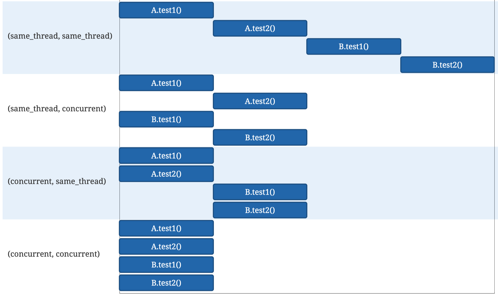

# 테스트 병렬 실행

기본적으로 테스트들은 싱글 스레드안에서 순차적으로 실행된다.
설정 파일을 통해 병렬설정을 활성화 할 수 있다.

## 병렬 관련 옵션 설정

#### junit-platform.properties 설정 파일

`/src/test/resources` 하위에 `junit-platform.properties` 파일을 생성해준다.

| 옵션                                                      | 설명                                | 값                             | default     |
| --------------------------------------------------------- | ----------------------------------- | ------------------------------ | ----------- |
| junit.jupiter.execution.parallel.enabled                  | 병렬 실행 활성화 여부 설정          | true/false                     | true        |
| junit.jupiter.execution.parallel.mode.default             | 테스트 메서드 병렬 실행 모드 지정   | SAME_THREAD<br />CONCURRENT    | SAME_THREAD |
| junit.jupiter.execution.parallel.mode.classes.default     | 테스트 클래스의 병렬 실행 모드 지정 | SAME_THREAD<br />CONCURRENT    |             |
| junit.jupiter.execution.parallel.config.strategy          | 병렬성 전략 지정                    | dynamic<br />fixed<br />custom |             |
| junit.jupiter.execution.parallel.config.dynamic.factor    | dynamic 모드시 사용할 factor        |                                | 1           |
| junit.jupiter.execution.parallel.config.fixed.parallelism | fixed 모드시 사용할 병렬성 지정     |                                |             |
| junit.jupiter.execution.parallel.config.custom.class      | custom 모드시 사용할 전략 지정      |                                |             |

병렬적 실행을 활성화 설정을 먼저 해주더라도, 테스트는 순차적으로 실행된다.

```properties
junit.jupiter.execution.parallel.enabled=true
```

#### @Execution(ExecutionMode.CONCURRENT)

기본적으로 활성화 설정만 해둔 후 `@Execution(ExecutionMode.CONCURRENT)` 어노테이션을 붙여 해당 어노테이션이 붙은 클래스만 병렬로 수행할 수 있게 구성할 수도 있다.

### 병렬 실행 모드

병렬 실행 모드 및 전략에 대한 추가 설정을 해줘야한다.
병렬 실행 모드에는 `SAME_THREAD`, `CONCURRENT` 두가지 종류가 있다.

- SAME_THREAD : 부모가 사용하던 스레드를 사용
  - 테스트 메소드 사용시, 테스트 클래스에 있는 `@BeforeAll`, `@AfterAll` 메서드가 사용하던 스레드를 같이 사용
- CONCURRENT : 동일한 스레드에서 강제 실행되지 않는 한 동시 실행



#### 모든 테스트 병렬 수행 옵션

```properties
junit.jupiter.execution.parallel.enabled=true
junit.jupiter.execution.parallel.mode.default=CONCURRENT
```

`LifeCycle.PER_CLASS` 모드 혹은 `MethodOrdered`를 사용하는 테스트 클래스를 제외하고 테스트 트리의 모든 노드에 적용된다. 
위 두 가지의 경우에는 테스트 클래스 `@Execution(CONCURRENT)` 어노테이션이 테스트 클래스 혹은 메서드에 있는 경우에만 병렬 실행 된다.

#### 클래스 병렬 수행, 클래스 내 메서드 동일 스레드 수행 옵션

테스트 클래스를 병렬적으로 실행하지만 클래스마다 메서드를 같은 스레드안에서 실행하려면 다음과 같이 설정하면된다.

```properties
junit.jupiter.execution.parallel.enabled=true
junit.jupiter.execution.parallel.mode.default=SAME_THREAD
junit.jupiter.execution.parallel.mode.classes.default=CONCURRENT
```

#### 테스트 클래스 순차 실행, 클래스 내 메서드 병렬 실행

```properties
junit.jupiter.execution.parallel.enabled=true
junit.jupiter.execution.parallel.mode.default=CONCURRENT
junit.jupiter.execution.parallel.mode.classes.default=SAME_THREAD
```

### 병렬 수행 전략

`ParallelExecutionConfigurationStrategy`을 이용하여 원하는 병렬 처리 및 최대 풀 크기와 같은 속성을 지정하여 구성할 수 있으며, 병렬성 전략에는 `dynamic`, `fixed`, `custom` 세가지가 있다.

#### dynamic

- `junit.jupiter.execution.paralle.config.dynamic.factor` 설정 파라미터에 설정된 값과 사용 가능한 프로세서와 코어 수를 곱하여 병렬 처리를 계산한다.

#### fixed

- `junit.jupiter.execution.parallel.config.fixed.parallelism` 에 설정한 값으로 병렬 처리
- 4로 설정했으면, 총 4개의 테스트가 동시에 수행된다.

```properties
junit.jupiter.execution.parallel.enabled=true
junit.jupiter.execution.parallel.mode.default=CONCURRENT
junit.jupiter.execution.parallel.config.strategy=fixed
junit.jupiter.execution.parallel.config.fixed.parallelism=5
```

#### custom

- `junit.jupiter.execution.parallel.config.custom.class` 설정 파라미터를 통해 `ParallelExecutionConfigurationStrategy`를 커스텀하여 원하는 설정을 지정한다.