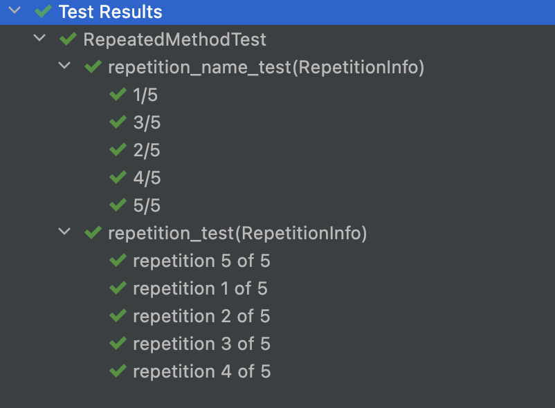
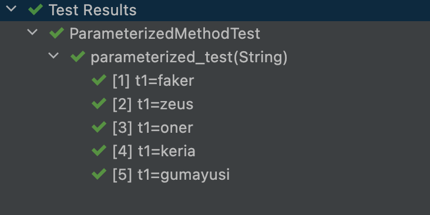
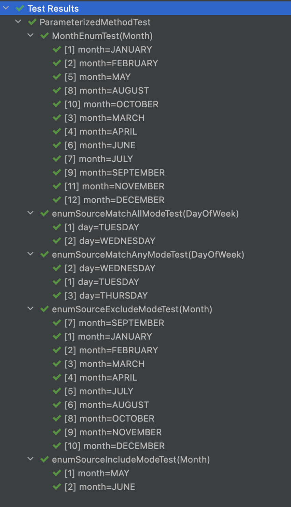
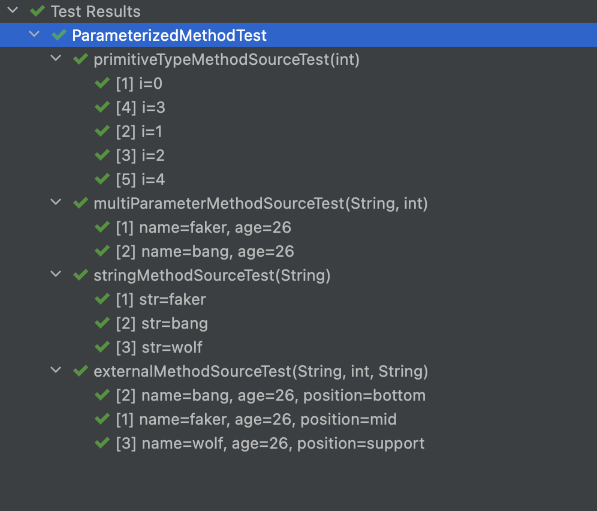
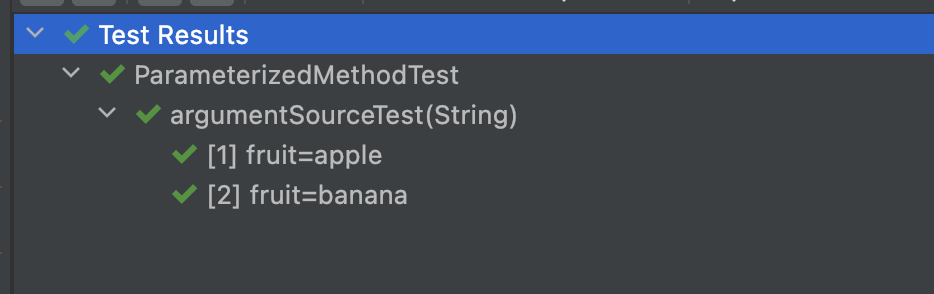

# 테스트 메서드

## @Test

테스트 메소드를 나타내는 어노테이션으로, 테스트하고자 하는 메서드에 필수로 작성되어야한다.

```java
public class JunitJupiterTests {
    @Test
    void stringTest() {
        assertThat(StringUtils.hasText("")).isFalse();
    }
}
```

- `@Test` 메서드는 정적 테스트 케이스로, 컴파일 시간에 모든 내용이 결정된다.
- 실행 시간 동안에는 TC의 동작을 변경할 수 없다.
- `Assumption` 메서드를 활용해 동적인 동작을 추가할 수 있으나 제한된 부분이 있다.

## @RepeatedTest

| 파라미터명 | 타입    | 설명                                 | default                                                      |
| ---------- | ------- | ------------------------------------ | ------------------------------------------------------------ |
| **value**  | **int** | 반복 횟수(반드시 0이상)<br />필수 값 |                                                              |
| name       | String  | 반복시 나타나는 테스트명             | repetition + {currentRepetition} + of + {totalRepetitions}<br />ex) repetition 1 of 5 |

반복 수 지정시, 각각 반복되는 테스트에 대한 display name을 지정할 수 있으며, 이때 정적 placeholder를 사용해 패턴을 만들 수도 있다.

- `{displayName}` : `@RepeatedTest` 메서드의 Display Name
- `{currentRepetition}` : 현재 반복 횟수
- `{totalRepetitions}` : 반복활 총 횟수

[Resolver](./junit5#Dependency Injection)를 이용해 `RepetitionInfo`, `TestInfo`타입의 인자를 받을 수 있다.

```java
public class RepeatedMethodTest {

    @RepeatedTest(5)
    void repetition_test(TestInfo testInfo, RepetitionInfo repetitionInfo) {
        assertThat(testInfo.getDisplayName()).isEqualTo("repetition " + repetitionInfo.getCurrentRepetition() + " of " + repetitionInfo.getTotalRepetitions());
        assertThat(repetitionInfo.getTotalRepetitions()).isEqualTo(5);
    }

    @RepeatedTest(value = 5, name = "{displayName} {currentRepetition}/{totalRepetitions}")
    void repetition_name_test(RepetitionInfo repetitionInfo) {
        assertThat(repetitionInfo.getTotalRepetitions()).isEqualTo(5);
    }
}
```



## @ParameterizedTest

파라미터화 테스트는 각각 다른 인자로 테스트를 반복적으로 실행할 수 있게 해주는 어노테이션이다.

| **파라미터명**                   | **타입** | **설명**                                                     |
| -------------------------------- | -------- | ------------------------------------------------------------ |
| name                             | String   | @DisplayName 설정                                            |
| DISPLAY_NAME_PLACEHOLDER         | String   | @DisplayName과 동일                                          |
| INDEX_PLACEHOLDER                | String   | 현재 실행 인덱스                                             |
| ARGUMENTS_PLACEHOLDER            | String   | 현재 실행된 파라미터 값                                      |
| ARGUMENTS_WITH_NAMES_PLACEHOLDER | String   | 현재 실행된 파라미터명 + "=" + 값                            |
| DEFAULT_DISPLAY_NAME             | String   | 기본값  "[" + INDEX_PLACEHOLDER + "] " + ARGUMENTS_WITH_NAMES_PLACEHOLDER |

`@ParameterizedTest`는 단독으로 사용 못하며, 추가적으로 호출 시 사용될 인자도 최소 1개 적어줘야한다.

#### placeholder

| Placeholder          | Description                                                  |
| -------------------- | ------------------------------------------------------------ |
| {displayName}        | 메소드의 이름                                                |
| {index}              | 현재 호출된 인덱스                                           |
| {arguments}          | the complete, comma-separated arguments list                 |
| {argumentsWithNames} | the complete, comma-separated arguments list with parameter names |
| {0}, {1}, …          | 0번째 인자 1번째 인자..                                      |

또한 `@ParamterizedTest`를 사용할 때는 항상 인자를 받는 파라미터가 먼저 와야한다.

```java
# 올바른 예
@ParameterizedTest
@ValueSource(strings = "test")
void testWithRegularParameterResolver(String str, TestReporter testReporter) {
    testReporter.publishEntry("argument", str);
}

# 잘못된 예
@ParameterizedTest
@ValueSource(strings = "test")
void testWithRegularParameterResolver(TestReporter testReporter, String str) {
    testReporter.publishEntry("argument", str);
}
```

### @ValueSource

다양한 타입의 인자를 배열로 받아서 사용할 수 있게 해주는 어노테이션
**하나의 인자만 받는 파라미터화 테스트에만 적용 가능**하다.

- 지원하는 타입: `short`,  `byte`, `int`, `long`, `float`, `double`, `char`, `boolean`, `java.lang.String`

```java
public class ParameterizedMethodTest {
    
    @ParameterizedTest
    @ValueSource(strings = {"faker", "zeus", "oner", "keria", "gumayusi"})
    void parameterized_test(String t1) {
        assertThat(StringUtils.hasText(t1));
    }
}
```



### Null and 빈 값 테스트

잘못된 입력이 들어올 수 있는 경우에 대한 테스트를 할수도 있다.

| 어노테이션          | 설명                                                         |
| ------------------- | ------------------------------------------------------------ |
| @NullSource         | @ParameterizedTest 메소드에 null을 제공<br />primitive type (int, long 등)에는 사용할 수 없음. |
| @EmptySource        | 객체 배열, 컬렉션 등의 타입에 빈값을 제공                    |
| @NullAndEmptySource | @NullSource 와 @EmptySource 기능들을 합친 어노테이션         |

### @EnumSource

Enum에 정의된 상수 테스트를 가능하게 해주는 어노테이션이다.

| 파라미터명 | 타입                       | 설명                                                         | default                                      |
| ---------- | -------------------------- | ------------------------------------------------------------ | -------------------------------------------- |
| value      | `Class<? extends Enum<?>>` | 테스트할 Enum 클래스                                         | `org.junit.jupiter.params.provider.NullEnum` |
| names      | `String[]`                 | 검색 조건 (문자열, 정규식)  mode에서 사용됌                  |                                              |
| mode       | `Mode`                     | EnumSource.Mode.INCLUDE, EnumSource.Mode.EXCLUDE, EnumSource.Mode.MATCH_ALL, EnumSource.Mode.MATCH_ANY, names | EnumSource.Mode.INCLUDE                      |

```java
    @ParameterizedTest
    @EnumSource
    void MonthEnumTest(Month month) {
        assertThat(month).isNotNull();
    }

    @ParameterizedTest
    @EnumSource(names = {"MAY", "JUNE"})
    void enumSourceIncludeModeTest(Month month) {
        assertThat(EnumSet.of(Month.JUNE, Month.MAY)).contains(month);
    }

    @ParameterizedTest
    @EnumSource(mode = EnumSource.Mode.EXCLUDE, names = {"MAY", "JUNE"})
    void enumSourceExcludeModeTest(Month month) {
        assertThat(EnumSet.of(Month.JUNE, Month.MAY)).doesNotContain(month);
    }

    @ParameterizedTest
    @EnumSource(mode = EnumSource.Mode.MATCH_ANY, names = {"^.*SDAY$","^.*ESDAY$"})
    void enumSourceMatchAnyModeTest(DayOfWeek day) {
        assertThat(EnumSet.of(DayOfWeek.THURSDAY, DayOfWeek.TUESDAY, DayOfWeek.WEDNESDAY)).contains(day);
    }

    @ParameterizedTest
    @EnumSource(mode = EnumSource.Mode.MATCH_ALL, names = {"^.*SDAY$","^.*ESDAY$"})
    void enumSourceMatchAllModeTest(DayOfWeek day) {
        assertThat(EnumSet.of(DayOfWeek.TUESDAY, DayOfWeek.WEDNESDAY)).contains(day);
    }
```



### @MethodSource

복잡한 인수를 전달할 때 사용하는 방법으로 다음 조건을 지켜야한다.

- 클래스 단위 생명주기(`@TestInstance(Lifecycle.PER_CLASS)` )가 아닌 경우에는 static method여야한다.
- 각각의 팩터리 메서드는 반드시 `Stream` 타입을 리턴해야한다.
- 인자가 없어야한다.

| 파라미터명 | 타입명 | 설명              | defulat                  |
| ---------- | ------ | ----------------- | ------------------------ |
| value      | String | factory 메소드 명 | 테스트 메소드명이랑 동일 |

```java
    @ParameterizedTest
    @MethodSource
    void stringMethodSourceTest(String str) {
        assertThat(StringUtils.hasText(str)).isTrue();
    }

    static Stream<String> stringMethodSourceTest() {
        return Stream.of("faker", "bang", "wolf");
    }

    @ParameterizedTest
    @MethodSource("range")
    void primitiveTypeMethodSourceTest(int i) {
        assertThat(i).isLessThan(20);
    }

    static IntStream range() {
        return IntStream.range(0, 20);
    }
```

default값이 테스트 메소드명이므로 테스트 메소드명과 동일한 경우 생략이 가능하다.

#### 파라미터가 여러개인 경우

테스트 메서드 파라미터가 여러개인 경우일 때는 `Arguements` 를 사용해 반환해주면된다.

```java
    @ParameterizedTest
    @MethodSource("stringAndIntProvider")
    void multiParameterMethodSourceTest(String name, int age) {
        assertThat(name).isNotBlank();
        assertThat(age).isEqualTo(26);
    }

    static Stream<Arguments> stringAndIntProvider() {
        return Stream.of(
                Arguments.arguments("faker", "26"),
                Arguments.arguments("bang", "26")
        );
    }
```

#### 외부 정적 팩토리 메서드를 사용하는 경우

```java
package dh0023.example.springbatchreal.junit5.testmethod;

import org.junit.jupiter.params.provider.Arguments;
import java.util.stream.Stream;

public class T1 {

    static Stream<Arguments> members() {
        return Stream.of(
                Arguments.arguments("faker", "26", "mid"),
                Arguments.arguments("bang", "26", "bottom"),
                Arguments.arguments("wolf", "26", "support")
        );
    }

}
```

```java
    @ParameterizedTest
@MethodSource("dh0023.example.springbatchreal.junit5.testmethod.T1#members")
    void externalMethodSourceTest(String name, int age, String position) {
        assertThat(name).isNotBlank();
        assertThat(position).isNotBlank();
        assertThat(age).isEqualTo(26);
    }

```



### @ArgumentsSource

커스텀 또는 재사용가능한 `ArgumentsProvider`를 지정해줄 때 사용한다.
`ArguementsProvider`는 반드시 클래스 탑 레벨에 선언하거나, 정적 중첩 클래스로 선언해야한다.

```java

    @ParameterizedTest
    @ArgumentsSource(value = MyArgumentsProvider.class)
    void argumentSourceTest(String fruit) {
        assertThat(fruit).isNotBlank();
    }

    static class MyArgumentsProvider implements ArgumentsProvider {

        @Override
        public Stream<? extends Arguments> provideArguments(ExtensionContext context) {
            return Stream.of("apple", "banana").map(Arguments::of);
        }
    }

```




## 참고

- [민동현 - JUnit5 완벽가이드](https://donghyeon.dev/junit/2021/04/11/JUnit5-%EC%99%84%EB%B2%BD-%EA%B0%80%EC%9D%B4%EB%93%9C/)
- [노력남자 - JUnit 5](https://effortguy.tistory.com/)
