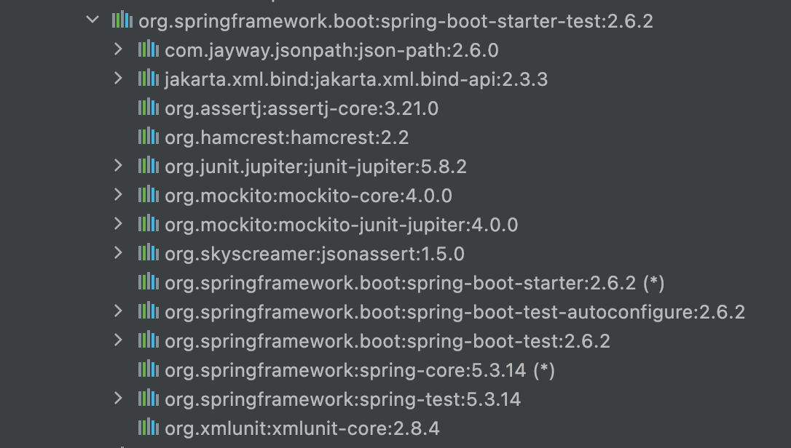
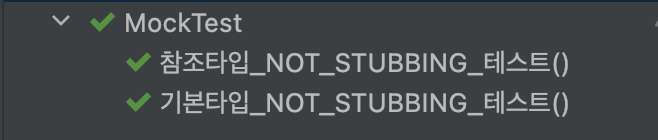
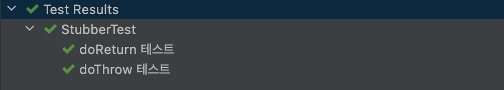

# Mock

Mock은 "모의, 가짜의"라는 뜻으로, 테스트시 실제 객체와 동일한 모의 객체를 만들어 테스트 효용성을 높이기 위해 사용한다.

> **모의 객체**(Mock Object)란 주로 [객체 지향 프로그래밍](https://ko.wikipedia.org/wiki/객체_지향_프로그래밍)으로 개발한 프로그램을 테스트 할 경우 테스트를 수행할 모듈과 연결되는 외부의 다른 서비스나 모듈들을 실제 사용하는 모듈을 사용하지 않고 **실제의 모듈을 "흉내"내는 "가짜" 모듈을 작성하여 테스트의 효용성을 높이는데 사용하는 객체**이다.
>
> *[위키 백과-모의 객체](https://ko.wikipedia.org/wiki/%EB%AA%A8%EC%9D%98_%EA%B0%9D%EC%B2%B4)*

## [Mockito](https://site.mockito.org)

Mockito는 Mock 객체를 지원하는 테스트 프레임워크로, Mockito를 활용하여 가짜 객체에 원하는 결과를 Stub하여 단위 테스트를 진행할 수 있다.

### 환경 설정

스프링 부트 2.0이후에는 `spring-boot-starter-test` dependency에 포함되어 있다.



#### gradle

```groovy
repositories { mavenCentral() }
dependencies { testImplementation "org.mockito:mockito-core:4.0.0" }
```

### 시작하기

라이브러리 설정 후 Mockito를 사용하기 위해서는 테스트 클래스 위에 `@ExtendWith(MockitoExtension.class)`를 추가해줘야한다.

```java
@ExtendWith(MockitoExtension.class)
public class mockTest {
}
```

### Mock 생성

mock 생성과 관련된 어노테이션은 `@Mock`, `@Spy`, `@InjectMock`이 있다.

mock 생성 관련 테스트를 위해 임의로 `ItemService`를 생성해주었다.

```java
public class ItemService {

    public Item getItem() {
        return new Item("0000000001", "10");
    }

    public boolean isOnlineMallItem() {
        return true;
    }
}
```

#### @Mock

`@Mock`은 Mock 객체를 만들어 반환해주는 어노테이션이다.
생성한 mock 객체는 stubbing을 해주지 않고, 호출하게 되면 primitive type은 0, 참조형은 null을 반환한다.

```java
@ExtendWith(MockitoExtension.class)
public class MockTest {
    @Mock
    ItemService itemService;

    @Test
    void 참조타입_NOT_STUBBING_테스트() {
        assertThat(itemService.getItem()).isNull();
    }

    @Test
    void 기본타입_NOT_STUBBING_테스트() {
        assertThat(itemService.isOnlineMallItem()).isFalse();
    }
}
```



#### @Spy

`@Spy`로 생성한 mock 객체는 실제 객체이며, 메소드 실행 시 stubbing을 하지 않으면 기존 로직을 실행한 값을, stubbing을 한 경우에는 그 값을 반환한다.

```java
@ExtendWith(MockitoExtension.class)
public class SpyTest {

    @Spy
    ItemService itemService;

    @Test
    void NOT_STUBBING_테스트() {
        // given

        // when
        Item item = itemService.getItem();

        // then
        assertThat(item).isNotNull();
        assertThat(item.getItemDivCd()).isEqualTo("10");
        assertThat(item.getItemId()).isEqualTo("0000000001");
    }

    @Test
    void STUBBING_테스트() {

        // given
        when(itemService.getItem())
                .thenReturn(new Item("0000000002", "20"));

        // when
        Item item = itemService.getItem();

        // then
        assertThat(item).isNotNull();
        assertThat(item.getItemDivCd()).isEqualTo("20");
        assertThat(item.getItemId()).isEqualTo("0000000002");

    }
}
```


#### [@InjectMocks](https://javadoc.io/doc/org.mockito/mockito-core/latest/org/mockito/InjectMocks.html)

`@InjectMocks`은 `@Mock` 혹은 `@Spy`로 생성한 객체를 자동으로 주입해주는 어노테이션이다.
해당 어노테이션을 사용해 주입받을 수 있는 형태는 Constructure, Property Setter, Field Injection이 있다.

### Stub

Stub(Stubbing)은 토막, 남은 부분, 꽁초, 몽당연필이라는 의미를 가지고 있으며 가짜 객체가 마치 실제로 동작하는 것처럼 보이도록 만들어놓은 것이다.

>Test stubs provide [canned answers](https://en.wikipedia.org/wiki/Canned_response) to calls made during the test, usually not responding at all to anything outside what’s programmed in for the test.
>
>*[wikipedia](https://en.wikipedia.org/wiki/Test_stub)*

즉, stub은 만들어진 mock 객체가 어떤 값을 반환할지를 정의하는 것이다.

#### OngoingStubbing

Mockito에서는 when 메소드를 이용해 OngoingStubbing을 지원하고 있다.
OngoingStubbing은 when에 넣은 메소드의 리턴값을 정의해주는 메소드이다.

| 메소드명           | 설명                                                         |
| ------------------ | ------------------------------------------------------------ |
| thenReturn         | Stubbing한 메소드 호출 후 어떤 객체를 반환할지 정의          |
| thenThrow          | Stubbing한 메소드 호출 후 어떤 Exception을 Throw할지 정의    |
| thenAnswer         | Stubbing한 메소드 호출 후 어떤 작업을 할지 custom 정의<br />**이 메소드는 사용하지 말고, thenReturn, thenThrow 사용 권장** |
| thenCallRealMethod | 실제 메소드 호출                                             |

```java
when({stubbing할 메소드}).{OngoingStubbing 메소드};
```

```java
@ExtendWith(MockitoExtension.class)
public class OngoingStubbingTest {

    @Mock
    ItemService itemService;

    @Test
    void thenReturn_테스트() {
        Item item = new Item("0000000002", "20");
        when(itemService.getItem())
                .thenReturn(item);

        assertThat(itemService.getItem()).isEqualTo(item);
    }


    @Test
    void thenThrow_테스트() {
        when(itemService.getItem())
                .thenThrow(new IllegalArgumentException());

        assertThrows(IllegalArgumentException.class, () -> {
            itemService.getItem();
        });
    }

    @Test
    void thenCallRealMethod_테스트() {
        when(itemService.getItem())
                .thenCallRealMethod();

        assertThat(itemService.getItem()).isNotNull();
        assertThat(itemService.getItem().getItemId()).isEqualTo("0000000001");
    }
}
```


메소드 체이닝으로 사용하면, 호출시마다 다른 Stubbing을 호출할 수 있다.

```java
    @Test
    void 메소드체이닝_테스트() {
        Item item = new Item("0000000002", "20");
        when(itemService.getItem())
                .thenReturn(item)
                .thenThrow(new RuntimeException());

        assertThat(itemService.getItem()).isEqualTo(item);

        assertThrows(RuntimeException.class, () -> {
            itemService.getItem();
        });
    }
```


#### Stubber

Stubber 메소드는 반드시 Stubbing이 실행되야하는 경우 사용하는 메소드이다.

| **메소드명**     | **설명**                                                   |
| ---------------- | ---------------------------------------------------------- |
| doReturn         | Stubbing 메소드 호출 후 어떤 행동을 할 건지 정의           |
| doThrow          | Stubbing 메소드 호출 후 어떤 Exception을 throw할 건지 정의 |
| doAnswer         | Stubbing 메소드 호출 후 작업을 할지 custom하게 정의        |
| doNothing        | Stubbing 메소드 호출 후 어떤 행동도 하지 않게 정의         |
| doCallRealMethod | 실제 메소드 호출                                           |

```java
{Stubber 메소드}.when({Stubbing할 클래스}).{Stubbing 할 메소드}
```

```java

@ExtendWith(MockitoExtension.class)
public class StubberTest {

    @Mock
    ItemService itemService;


    @Test
    void doReturn_테스트() {
        List list = new LinkedList();

        List spyList = spy(list);

        doReturn("test").when(spyList).get(0);

        assertThat(spyList.get(0)).isEqualTo("test");

        Item item = new Item("0000000003", "30");
        doReturn(item)
                .when(itemService)
                .getItem();

        assertThat(itemService.getItem()).isEqualTo(item);
    }

    @Test
    void doThrow_테스트() {
        doThrow(new RuntimeException()).when(itemService).getItem();

        assertThatThrownBy(() -> itemService.getItem()).isInstanceOf(RuntimeException.class);
        assertThrows(RuntimeException.class, () -> {
            itemService.getItem();
        });
    }
}
```



#### 검증

`verify()` 를 이용하여 Stubbing한 메소드가 정상적으로 실행됐는지 검증할 수 있다.

```java
verify(T mock, VerificationMode mode)
```

| 메소드명            | 설명                                                         |
| ------------------- | ------------------------------------------------------------ |
| times(n)            | 몇 번이 호출됐는지 검증                                      |
| never               | 한 번도 호출되지 않았는지 검증                               |
| atLeastOne          | 최소 한 번은 호출됐는지 검증                                 |
| atLeast(n)          | 최소 n 번이 호출됐는지 검증                                  |
| atMostOnce          | 최대 한 번이 호출됐는지 검증                                 |
| atMost(n)           | 최대 n 번이 호출됐는지 검증                                  |
| calls(n)            | n번이 호출됐는지 검증 (InOrder랑 같이 사용해야 함)           |
| only                | 해당 검증 메소드만 실행됐는지 검증                           |
| timeout(long mills) | n ms 이상 걸리면 Fail 그리고 바로 검증 종료                  |
| after(long mills)   | n ms 이상 걸리는지 확인<br />**timeout과 다르게 시간이 지나도 바로 검증 종료가 되지 않음** |
| description         | 실패한 경우 나올 문구                                        |

```java
@ExtendWith(MockitoExtension.class)
public class VerifyTest {

    @Mock
    ItemService itemService;

    @Test
    void times_테스트() {
        itemService.getItem();
        itemService.getItem();

        // 몇번 호출됐는지 검증
        verify(itemService, times(2)).getItem();
    }

    @Test
    void never_테스트() {

        // 한 번도 호출되지 않았는지 검증
        verify(itemService, never()).getItem();
    }

    @Test
    void atLeastOnce_테스트() {

        itemService.getItem();
        itemService.getItem();
        itemService.getItem();
        itemService.getItem();

        // 최소 1번 호출됐는지 검증
        verify(itemService, atLeastOnce()).getItem();
    }

    @Test
    void atLeast_테스트() {

        itemService.getItem();
        itemService.getItem();
        itemService.getItem();
        itemService.getItem();

        // 최소 N번 호출됐는지 검증
        verify(itemService, atLeast(4)).getItem();
    }

    @Test
    void atMostOnce_테스트() {

        itemService.getItem();

        // 최대 N번 호출됐는지 검증
        verify(itemService, atMostOnce()).getItem();
    }

    @Test
    void atMost_테스트() {

        itemService.getItem();
        itemService.getItem();
        itemService.getItem();
        itemService.getItem();

        // 최대 N번 호출됐는지 검증
        verify(itemService, atMost(4)).getItem();
    }
    
    @Test
    void inOrder_calls_테스트() {
        itemService.getItem();
        itemService.getItem();
        itemService.getItem();
        itemService.deleteItem();

        InOrder inOrder = inOrder(itemService);

        inOrder.verify(itemService, calls(3)).getItem();
        inOrder.verify(itemService).deleteItem();
    }

}
```

## 참고

- [Mockito API Guide](https://javadoc.io/doc/org.mockito/mockito-core/latest/index.html)
- [노력남자](https://effortguy.tistory.com/)