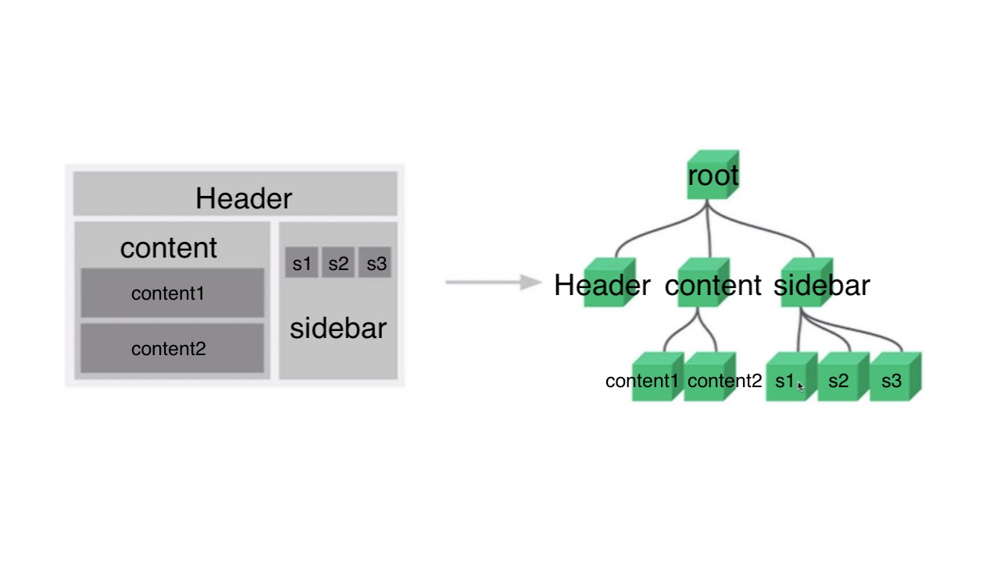

# Component

Component란 조합하여 화면을 구성할 수 있는 블록을 의미한다. 



왼쪽 그림은 각 영역을 컴포넌트로 지정하여 구분한 것이고, 오른쪽 그림은 각 컴포넌트 간의 관계를 나타낸 것이다. 이러한 컴포넌트 간의 관계는 뷰에서 화면을 구성하는 데 매우 중요한 역할을 하며, 웹 페이지 화면을 설계할 때도 이와 같은 골격을 유지하면서 설계해야한다. 컴포넌트 기반 방식으로 개발하는 이유는 코드 재사용이 쉽기 때문이다. 그리고 뷰의 경우에는 컴포넌트를 사용해 HTML 코드에서 화면을 직관적으로 파악할 수 있다. 즉, **프레임워크 자체에서 컴포넌트 방식을 추구하면 모두가 정해진 방식으로 컴포넌트를 활용하므로 빠르게 구현할 수 있으며, 다른 사람의 코드를 보는 것도 수월해진다.**

### 컴포넌트 등록하기

지역(local) 컴포넌트는 특정 인스턴스에서만 유효한 범위를 갖고, 전역(global) 컴포넌트는 여러 인스턴스에서 공통으로 사용할 수 있다.

#### 전역 컴포넌트

전역 컴포넌트는 뷰 라이브러리를 로딩하고 나면 접근 가능한 Vue 변수를 이용해 등록한다. 

```js
Vue.component('컴포넌트명',{
  // 컴포넌트 내용
});
```

- 컴포넌트명 : template 속성에서 사용할 HTML 사용자 정의 태그 이름을 의미
- 컴포넌트 내용 : 컴포넌트 태그가 실제 화면의 HTML 요소로 변환될 때 표시될 속성들을 작성
  - template, data, methods 등 인스턴스 옵션 속성을 정의할 수 있다.

```html
<!DOCTYPE html>
<html lang="en">
<head>
	<meta charset="UTF-8">
	<title>Vue Component</title>
</head>
<body>
	<div id="app">
		<button>컴포넌트 등록</button>
		<my-component></my-component> <!--전역 컴포넌트 표시-->
	</div>
	<script src="https://cdn.jsdelivr.net/npm/vue/dist/vue.js"></script>
	<script>
		// 전역컴포넌트 등록
		Vue.component('my-component',{
			template: '<div>전역 컴포넌트 등록</div>'
		});

		new Vue({
			el: '#app'
		});
	</script>
</body>
</html>
```

인스턴스 내용이 화면 요소로 변환될 대 등록된 컴포넌트 태그도 함께 변환된다. 변환된 후 실제 HTML 코드는 다음과 같다.

```html
<div id="app">
	<button>컴포넌트 등록</button>
	<div>전역 컴포넌트 등록</div>
</div>
```

#### 지역 컴포넌트

```js
new Vue({
  components: {
    '컴포넌트 명' : 컴포넌트 내용
  }
});
```

지역 컴포넌트는 인스턴스에 `components` 속성을 추가하고 등록할 컴포넌트 명과 내용을 정의하면된다.

```html
<!DOCTYPE html>
<html lang="en">
<head>
	<meta charset="UTF-8">
	<title>Vue Component</title>
</head>
<body>
	<div id="app">
		<button>컴포넌트 등록</button>
		<my-local-component></my-local-component> <!--지역 컴포넌트 표시-->
	</div>
	<script src="https://cdn.jsdelivr.net/npm/vue/dist/vue.js"></script>
	<script>
		// 지역 컴포넌트
		var cmp = {
			// 지역 컴포넌트 내용
			template: '<div>지역 컴포넌트 등록</div>'
		};

		new Vue({
			el: '#app',
			components: {
				'my-local-component' : cmp
			}
		});
	</script>
</body>
</html>
```

변환된 실제 HTML은 다음과 같다.

```html
<div id="app">
  <button>컴포넌트 등록</button>
  <div>지역 컴포넌트 등록</div>
</div>
```

#### 지역 vs 전역

```html
<!DOCTYPE html>
<html lang="en">
<head>
	<meta charset="UTF-8">
	<title>Vue Component</title>
</head>
<body>
	<div id="app">
		<h3>첫 번째 인스턴스 영역</h3>
		<my-global-component></my-global-component> <!--전역 컴포넌트 표시-->
		<my-local-component></my-local-component> <!--지역 컴포넌트 표시-->
	</div>
	<hr>
	<div id="app2">
		<h3>두 번째 인스턴스 영역</h3>
		<my-global-component></my-global-component>
		<my-local-component></my-local-component>
	</div>
	<script src="https://cdn.jsdelivr.net/npm/vue/dist/vue.js"></script>
	<script>
		// 전역컴포넌트 등록
		Vue.component('my-global-component',{
			template: '<div>전역 컴포넌트 등록</div>'
		});

		// 지역 컴포넌트
		var cmp = {
			// 지역 컴포넌트 내용
			template: '<div>지역 컴포넌트 등록</div>'
		};

		new Vue({
			el: '#app',
			components: {
				'my-local-component' : cmp
			}
		});

		new Vue({
			el: '#app2'
		});
	</script>
</body>
</html>
```


전역 컴포넌트와 지역 컴포넌트는 유효범위가 다르다. 전역 컴포넌트는 인스턴스를 새로 생성할 때마다 인스턴스에 components 속성으로 등록할 필요없이 한번만 등록하면 어느 인스턴스에서든지 사용할 수 있다. 지역 컴포넌트는 인스턴스를 새로 생성할 때마다 등록해줘야한다.

```js
vue.js:634 [Vue warn]: Unknown custom element: <my-local-component> - did you register the component correctly? For recursive components, make sure to provide the "name" option.

(found in <Root>)
```

두번째 인스턴스의 `<my-local-component>` 태그는 유효 범위 안에 있더라도 이 컴포넌트가 등록된 첫 번째 인스턴스의 유효 범위를 벗어나기 때문에 브라우저에서 HTML 사용자 정의 태그로 인식하고, 뷰에서는 해당 컴포넌트를 제대로 등록했는지 물어보는 오류를 표시한다.

### 컴포넌트 간 통신과 유효 범위

**컴포넌트는 자체적으로 고유한 유효범위를 갖기때문에 뷰는 컴포넌트로 화면을 구성하므로 같은 웹 페이지라도 데이터를 공유할 수 없다.**  따라서 각 컴포넌트의 유효범위가 독립적이기 대문에 다른 컴포넌틔의 값을 직접적으로 참조할 수 없다.

```html
<!DOCTYPE html>
<html lang="en">
<head>
	<meta charset="UTF-8">
	<title>Vue Sample</title>
</head>
<body>
	<div id="app">
		<my-component1></my-component1>
		<my-component2></my-component2>
	</div>
	<script src="https://cdn.jsdelivr.net/npm/vue/dist/vue.js"></script>
	<script>
		var cmp1 = {
			template: '<div>첫 번째 지역 컴포넌트 : {{cmp1Data}}</div>',
			data: function(){
				return{
					cmp1Data: 100
				}
			}
		};
		var cmp2 = {
			template: '<div>두 번째 지역 컴포넌트 : {{cmp2Data}}</div>',
			data: function(){
				return{
					cmp2Data: cmp1.data.cmp1Data
				}
			}
		};

		new Vue({
			el: '#app',
			components: {
				'my-component1': cmp1,
				'my-component2': cmp2
			}
		});
	</script>
</body>
</html>
```

여기서 `cmp2Data`는 my-component1의 data.cmp1Data를 참조하고 있다. 하지만 my-component2에서 my-component1의 값을 직접 참조할 수 없다.

### 상하위 컴포넌트 관계

컴포넌트는 각각 고유한 유효 범위를 갖고 있기 때문에 직접 다른 컴포넌트의 값을 참조할 수 없다. 뷰 프레임워크 자체에서 정의한 컴포넌트 데이터 전달 방법을 따라하며, 가장 기본적인 전달 방법은 상위(부모) - 하위(자식) 컴포넌트간의 데이터 전달 방법이다.


부모에서 자식으로는 `props` 속성을 전달할 수 있다. 자식에서 부모로는 기본적인 이벤트만 전달할 수 있다.

#### props

`props`는 부모에서 자식 컴포넌트로 데이터를 전달할 때 사용하는 속성이다.

```js
Vue.component('child-component',{
  props: ['props 속성명']
});
```

컴포넌트 속성을 정의한 후 등록된 child-component 컴포넌트 태그에 `v-bind` 속성을 추가한다.

```html
<child-component v-bind:props 속성명 = "상위 컴포넌트의 data 속성"></child-component>
```

```html
<!DOCTYPE html>
<html lang="en">
<head>
	<meta charset="UTF-8">
	<title>Vue Sample</title>
</head>
<body>
	<div id="app">
		<child-component v-bind:propsdata="message"></child-component>
	</div>
	<script src="https://cdn.jsdelivr.net/npm/vue/dist/vue.js"></script>
	<script>
		Vue.component('child-component',{
			props: ['propsdata'],
			template: '<p>{{propsdata}}</p>'
		});
		new Vue({
			el: '#app',
			data: {
				message: 'Hello Vue!'
			}
		});
	</script>
</body>
</html>
```

컴포넌트 등록과 동시에 뷰 인스턴스 자체가 상위 컴포넌트가 되기 때문에 props 속성을 통해 데이터를 전달할 수 있다.

#### Emit Events(이벤트 발생)

자식에서 부모 컴포넌트로의 통신은 이벤트를 발생시켜서할 수 있다. 부모 컴포넌트에서 자식 컴포넌트의 특정 이벤트가 발생하면 상위 컴포넌트에서 해당 이벤트를 수신해 메서드를 호출할 수 있다.

##### 이벤트 발생과 수신 형식

이벤트 발생과 수신은 `$emit()`과`v-on:속성`을 사용해 구현한다.

```js
// event 발생
this.$emit('이벤트명');
```

`$emit()`을 호출하면 괄호 안에 정의된 이벤트가 발생하며, 일반적으로 `$emit()`을 호출하는 위치는 하위 컴포넌트 특정 메서드 내부이므로 여기서 `this`는 하위컴포넌트를 가리킨다.

```html
<!-- 이벤트 수신 -->
<child-component v-on:이벤트명="상위 컴포넌트 메세지명"></child-component>
```

호출한 이벤트는 하위 컴포넌트를 등록하는 태그에서 `v-on` 으로 받는다.

```html
<!DOCTYPE html>
<html lang="en">
<head>
	<meta charset="UTF-8">
	<title>Vue Sample</title>
</head>
<body>
	<div id="app">
		<child-component v-on:show-log="printText"></child-component>
	</div>
	<script src="https://cdn.jsdelivr.net/npm/vue/dist/vue.js"></script>
	<script>
		Vue.component('child-component',{
			template: '<button v-on:click="showLog">show</button>',
			methods:{
				showLog: function(){
					this.$emit('show-log');
				}	
			}
			
		});
		new Vue({
			el: '#app',
			data: {
				message: 'Hello Vue!'
			},
			methods: {
				printText: function(){
					console.log('recieved event');
				}
			}
		});
	</script>

</body>
</html>
```

이와 같은 방식으로 자식에서 부모 컴포넌트로 신호를 올려보내면 부모 컴포넌트의 메서드를 실행할 수도 있고, 자식 컴포넌트로 내려보내는 props의 값을 조정할 수도 잇다.

#### 같은 레벨 컴포넌트 간 통신

뷰는 상위에서 하위로만 데이터를 전달해야하는 기본적인 통신 규칙을 따르기 때문에 같은 레벨 컴포넌트에 값을 전달하려면 하위에서 공통적인 상위 컴포넌트로 이벤트를 전달한 후 공통 상위 컴포넌트에서 하위 컴포넌트에 **props**를 내려 보내야한다.  하지만 이렇게 통신을 하게되면 상위 컴포넌트가 필요없음에도 불구하고 같은 레벨간의 통신을 위해 강제로 상위 컴포넌트를 둬야한다. 이러한 점을 해결할 수 있는 방법이 **이벤트 버스**이다.

##### **이벤트 버스** - 관계 없는 컴포넌트 간 통신

이벤트 버스는 개발자가 지정한 2개의 컴포넌트 간에 데이터를 주고받을 수 있는 방법이다. 이벤트 버스를 이용하면 상위-하위 관계를 유지하지 않고 데이터를 다른 컴포넌트로 전달할 수 있다.

```js
// 이벤트 버스를 위한 추가 인스턴스 1개 생성
var eventBus = new Vue();
```
이벤트 버슬르 구현하려면 애플리케이션에 로직을 담는 인스턴스와는 별개로 새로운 인스턴스를 한개 생성해 이벤트를 주고받는다. `$emit()` 으로 데이터를 보내고,  `$on()`으로 데이터를 받는다.
```js
// 이벤트를 보내는 component
methods:{
  메서드명: function(){
    eventBus.$emit('이벤트명',데이터);
  }
}

// 이벤트를 받는 component
methods:{
  created: function(){
    eventBus.$on('이벤트명',function(데이터){
      ...
    });
  }
}
```

```html
<!DOCTYPE html>
<html lang="en">
<head>
	<meta charset="UTF-8">
	<title>Vue Sample</title>
</head>
<body>
	<div id="app">
		<child-component></child-component>
	</div>
	<script src="https://cdn.jsdelivr.net/npm/vue/dist/vue.js"></script>
	<script>
		var eventBus = new Vue();
		Vue.component('child-component',{
			template: '<div>하위 컴포넌트 영역. <button v-on:click="showLog">show</button></div>',
			methods:{
				showLog: function(){
					eventBus.$emit('triggerEventBus',100);
				}
			}
		});

		var app = new Vue({
			el:'#app',
			created: function(){
				eventBus.$on('triggerEventBus',function(value){
					console.log(value + '값을 전달받음');
				});
			}
		});
	</script>

</body>
</html>
```

show버튼 클릭시 showLog() 메서드가 실행되고 eventBus 이벤트가 발생한다. 그리고 발생한 이벤트는 상위 컴포넌트의 created에 있는 `eventBus.$on()`에서 전달받는다.

이벤트 버스를 활용하면 props 속성을 이용하지 않고도 원하는 컴포넌트 간에 직접적으로 데이터를 전달할 수 있어 편리하지만, 컴포넌트가 많아지면 어디서 어디로 보냈는지 관리가 되지 않는 문제가 발생한다. 이 문제를 해결하려면 **뷰엑스(Vuex)**라는 상태 관리 도구가 필요하다.