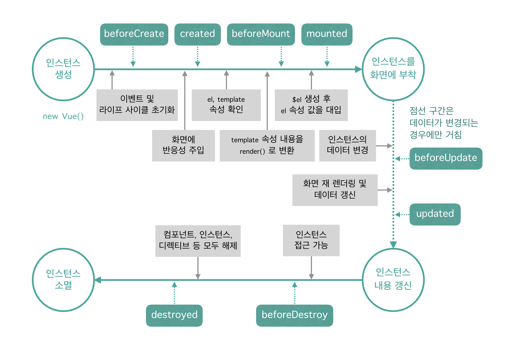

# Instance

뷰 인스턴스는 뷰로 화면을 개발하기 위해 필수적으로 생성해야하는 기본 단위이다.

### 인스턴스 형식

```js
new Vue({
  ...
});
```

#### 생성자

`new Vue()`로 인스턴스를 생성할 때 Vue를 생성자라고 한다. 생성자는 뷰 라이브러리를 로딩하고 나면 접근할 수 있다. 뷰에서 개발할 때 필요한 기능들을 생성자에 미리 정의해 놓고 사용자가 그 기능을 재정의하여 편리하게 사용하도록 하기위해 사용한다.

> 생상자란 객체를 새로 생성할 때 자주 사용하는 옵션과 기능들을 미리 특정 객체에 저장해 놓고, 새로 객체를 생성할 때 기존에 포함된 기능과 더불어 기존 기능을 쉽게 확장하여 사용하는 기법이다. 일반적으로 객체 지향 프로그래밍에서 사용하는 객체 정의 방식으로 미리 정의된 속성과 메서드를 재활용하기 위해 사용한다.

### 옵션 속성

뷰 인스턴스 옵션 속성은 인스턴스를 생성할 때 재정의할 **data, el, template** 등 속성을 의미한다.

| 속성     | 설명                                                         |
| -------- | ------------------------------------------------------------ |
| el       | 대상이 되는 html element 혹은 css selector                   |
| data     | 화면을 그리는데 사용하는 data를 반환하는 함수 혹은 data객체  |
| template | 화면에 표시할 HTML, CSS 등의 마크업 요소를 정의하는 속성     |
| methods  | 화면 로직 제어와 관련된 메서드를 정의하는 속성               |
| created  | 뷰 인스턴스가 생성되자마자 실행할 로직을 정의할 수 있는 속성 |

### 유효 범위

뷰 인스턴스를 생성하면 HTML의 특정 범위 안에서만 옵션 속성들이 적용되어 나타난다. 이를 인스턴스 유효 범위라고 한다. el 속성의 값이 가진 돔 요소가 인스턴스의 유효 범위이다. 

```html
<!DOCTYPE html>
<html lang="en">
<head>
	<meta charset="UTF-8">
	<title>Vue Sample</title>
</head>
<body>
	<div id="app">
		{{message}}
	</div>
	<script src="https://cdn.jsdelivr.net/npm/vue/dist/vue.js"></script>
	<script>
		new Vue({
			el: '#app',
			data: {
				message: 'Hello Vue.js!'
			}
		});
	</script>
</body>
</html>
```

위의 코드에서는 `#app` 이 el이므로, `<div id="app">{{message}}</div>` 가 유효범위인 것이다.

### 라이프 사이클

인스턴스의 상태에 따라 호출할 수 있는 속성들을 라이프 사이클 속성이라고 한다. 그리고 각 라이프 사이클 속성에서 실행되는 커스텀 로직을 라이프 사이클 훅(hook)이라고 한다.

> 라이프 사이클 : 일반적으로 애플리케이션이 가지는 생명 주기



위의 그림을 보면 인스턴스가 생성되고 나서 화면에 부착되고, 소멸되기까지의 전체적인 흐름을 나타낸 뷰 인스턴스 라이프 사이클 다이어그램이다.

#### beforeCreate

인스턴스가 생성되고 나서 가장 처음으로 실행되는 라이프 사이클 단계이다. 이 단계에서는 data 속성과 methods 속성이 아직 인스턴스에 정의되어 있지 않고, 돔과 같은 화면 요소에도 접근할 수 없다.

#### created

data 속성과 methods 속성이 정의 되었기 때문에 `this.data` or `this.fetchData()`와 같은 로직들을 이용해 data 속성과 methods 속성에 정의된 값에 접근해 로직을 실행할 수 있다. 아직 인스턴스가 화면에 부착되기 전이기 때문에 template 속성에 정의된 돔 요소로 접근할 수 없다.

data속성과 methods 속셍에 접근할 수 있는 첫 라이프 사이클 단계이며, **컴포넌트가 생성되고 나서 실행되는 단계이기 때문에 서버에 데이터를 요청하여 받아오는 로직을 수행하기에 좋다.**

#### beforeMount

template 속성에 지정한 마크업 속성을 `render()`함수로 변환 후 el 속성에 지정한 DOM에 인스턴스를 부착하기 전에 호출되는 단계이다. **`render()`함수가 호출되기 직전의 로직을 추가하기 좋다.**

> render()는 자바스크립트로 화면의 돔을 그리는 함수

#### mounted

el 속성에서 지정한 화면 요소(DOM)에 인스턴스가 부착되고 나면 호출되는 단계로, template 속성에 정의한 화면 요소에 접근할 수 있어 **화면 요소를 제어하는 로직을 수행하기 좋은 단계이다.** 돔에 인스턴스가 부착되자마자 바로 호출되기 때문에 하위 컴포넌트나 외부 라이브러리에 의해 추가된 화면 요소들이 최종 HTML 코드로 변환되는 시점과 다를 수 있다.

> 변환되는 시점이 다를 경우에는 $next Tick() API를 활용하여 HTML 코드로 최종 파싱될 때까지 기다린 후에 돔 제어 로직을 추가한다.

#### beforeUpdate

el 속성에서 지정한 화면 요소에 인스턴스가 부착되고 나면 인스턴스에 정의한 속성들이 화면에 치환된다. 치환된 값들은 뷰의 reactivity(반응성)을 제공하기위해 `$watch` 속성으로 접근할 수 있다.

> Reactivity
>
> 뷰의 특징 중 한가지로, 코드의 변화에 따라 화면이 반사적으로 반응하여 빠르게 화면을 갱신하는 것을 의미한다.

관찰하고 있는 데이터가 변경되면 변경 예정인 새 데이터에 접근할 수 있어 **변경 예정 데이터의 값과 관련된 로직**을 미리 넣을 수 있다.

#### updated

데이터가 변경되고 나서 가상 돔으로 다시 화면을 그리고나면 실행되는 단계이다. **데이터 변경 후 화면 요소 제어와 관련된 로직**을 추가하기 좋은 단계이다. 이 단계에서 데이터 값을 변경하면 무한 루프에 빠질 수 있으므로 값을 변경하려면 computed, watch와 같은 속성을 이용해야한다.

```
데이터 값을 갱신하는 로직은 가급적이면 beforeUpdate, 변경 데이터의 화면 요소와 관련된 로직은 updated에 추가하는 것이 좋다.
```

#### beforeDestory

뷰 인스턴스가 파괴되기 직전에 호출되는 단계로, 아직 인스턴스에 접근할 수 있으며, **뷰 인스턴스의 데이터를 삭제하기 좋은 단계**이다.

#### destroyed

뷰 인스턴스가 파괴되고 나서 호출되는 단계로, 뷰 인스턴스에 정의한 모든 속성이 제거되고 하위에 선언한 인스턴스들 또한 모두 파괴된다.