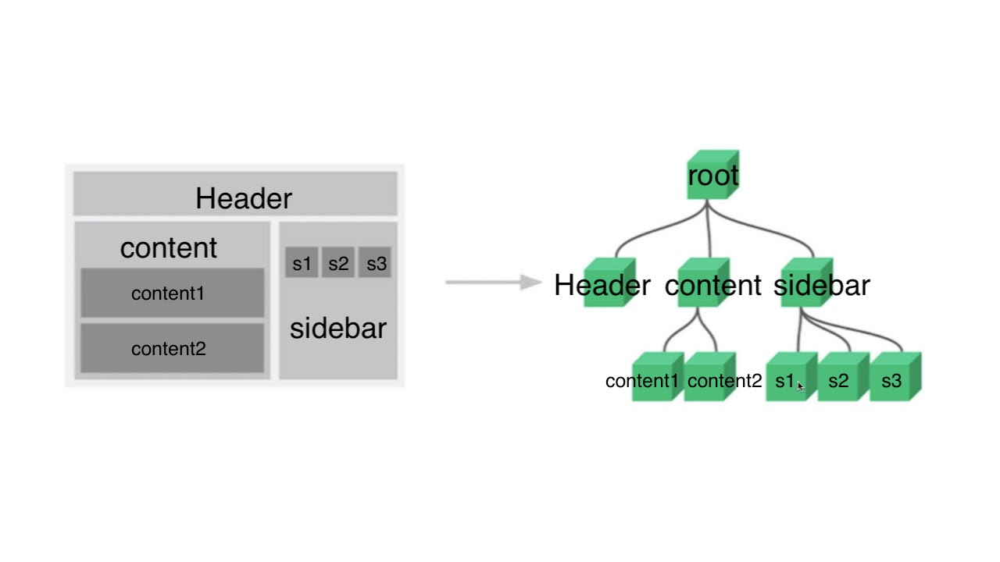

# Vue.js란?

Vue.js는 화면단 라이브러리이자 프레임워크라 볼 수 있다. 뷰 코어 라이브러리는 화면단 데이터 표현에 관한 기능들을 중점으로 지원하지만, 프레임워크 기능인 라우터, 상태 관리, 테스팅 등을 쉽게 결합할 수 있는 형태로 제공된다. 그래서 공식 문서에서는 뷰를 **점진적인 프레임워크(progressive framework)**라고 부른다.

**장점**

1. 러닝커브가 낮다.
2. react와 angular에 비해 성능이 우수하고, 빠르다.
3. react의 장점과 angular의 장점을 갖고 있다. ( angular의 데이터 바인딩 특성 & react의 virtual DOM 기반 렌더링 특징 ) 

[다른 프레임워크와 성능 비교](https://vuejs.org/v2/guide/comparison.html)

### 특징

#### UI 화면단 라이브러리

vue.js는 UI 화면 개발 방법 중 하나인 **MVVM** 패턴의 뷰 모델에 해당하는 화면단 라이브러리이다.

**MVVM** 패턴이란 화면을 **M**odel - **V**iew - **V**iew**M**odel 로 구조화하여 개발하는 방식을 말한다. 화면의 요소들을 제어하는 코드와 데이터 제어로직을 분리하여 코드를 더 직관적으로 이해할 수 있고, 유지 보수가 쉬워진다.

> MVVM *- 위키피디아*
>
> 마크업 언어나 GUI 코드를 비즈니스 로직 or 백엔드 로직과 분리하여 개발하는 소프트웨어 디자인 패턴

| 용어         | 설명                                                         |
| ------------ | ------------------------------------------------------------ |
| View         | 사용자에게 보이는 화면                                       |
| DOM          | HTML 문서에 들어가는 요소(태크, 클래스, 속성 등)의 정보를 담고 있는 데이터 트리 |
| DOM Listener | DOM의 변경 내역에 대해 바로 반응해 특정 로직을 수행하는 장치 |
| Model        | 데이터를 담는 용기, 보통 서버에서 가져온 데이터를 javascript 객체 형태로 저장 |
| Data Binding | View에 표시되는 내용과 Model의 데이터를 동기화               |
| ViewModel    | 뷰와 모델의 중간 영역, DOM Listener와 Data Binding을 제공하는 영역 |

vue는 화면의 요소가 변경되거나 조작이 일어날 때 즉각적으로 반응하여 화면의 데이터를 갱신하여 보여주는 역할을 한다. 화면의 표현에 주로 관여하는 라이브러리이기 때문에 화면단 라이브러리라고도 한다.

#### 컴포넌트 기반 프레임워크

 <a href="./2019-10-15-component.md">뷰의 컴포넌트</a>를 조합하여 화면을 구성할 수 있다. 왼쪽 그림은 각 영역을 컴포넌트로 지정하여 구분한 것이고, 오른쪽 그림은 각 컴포넌트 간의 관계를 나타낸 것이다. 컴포넌트 기반 방식으로 개발하는 이유는 코드 재사용이 쉽기 때문이다. 그리고 뷰의 경우에는 컴포넌트를 사용해 HTML 코드에서 화면을 직관적으로 파악할 수 있다. 즉, **프레임워크 자체에서 컴포넌트 방식을 추구하면 모두가 정해진 방식으로 컴포넌트를 활용하므로 빠르게 구현할 수 있으며, 다른 사람의 코드를 보는 것도 수월해진다.**

#### React와 Angular의 장점을 가진

vue는 angular의 **양방향 데이터 바인딩**과 react의 **단방향 데이터 흐름의 장점**을 모두 결합한 프레임워크이다. 

- 양방향 데이터 바인딩이란 화면에 표시되는 값과 프레임워크의 모델 데이터 값이 동기화되어 한쪽이 변경되면 다른 한쪽도 자동으로 변경되는 것을 말한다. 
- 단방향 데이터 흐름은 컴포넌트의 단방향 통신을 의미하며, 컴포넌트 간에 데이터를 전달할 때 항상 상위 컴포넌트에서 하위 컴포넌트 방향으로만 전달하도록 구조화되어 있는 것을 말한다.

이 외에도 빠른 화면 렌더링을 위해 react의 **Virtual DOM** 렌더링 방식을 적용해 적합한 동작 구조를 갖추고 있다. Virtual DOM을 활용하면 특정 돔 요소를 추가하거나 삭제하는 변경 발생시 화면 전체를 다시 그리지 않고 프레임워크에서 정의한 방식에 따라 화면을 갱신한다. 브라우저 입장에서는 성능 부하가 줄어들어 일반적인 렌더링 방식보다 더 빠르게 화면을 그릴 수 있다.