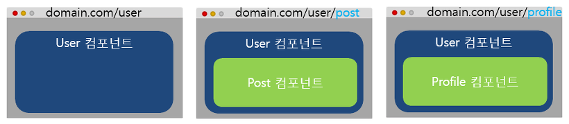

# Router

**라우팅(Routing)이란 웹 페이지 간의 이동 방법**을 말한다. 라우팅은 SPA(Single Page Application)에서 주로 사용하고 있다.

> SPA 
>
> 페이지를 이동할 때마다 서버에 웹 페이지를 요청해 새로 갱신하는 것이 아니라 미리 해당 페이지들을 받아 놓고 페이지 이동 시에 클라이언트의 라우팅을 이용해 화면을 갱신하는 패턴을 적용한 애플리케이션

라우팅을 이용하면 화면간의 전환이 매끄러우며, 사용자 경험을 향상 시킬 수 있다.

## 뷰 라우터

뷰 라우터는 뷰에서 라우팅 기능을 구현할 수 있도록 지원하는 공식 라이브러리이다.

| 태그                       | 설명                                                         |
| -------------------------- | ------------------------------------------------------------ |
| \<router-linkt to ="URL"\> | 페이지 이동 태그. 화면에서는 `<a>`로 표시되며 클릭하면 to에 지정한 URL로 이동한다. |
| \<router-view\>            | 페이지 표시 태그. 변경되는 URL에 따라 해당 컴포넌트를 뿌려주는 영역이다. |

```html
<!DOCTYPE html>
<html lang="en">
<head>
	<meta charset="UTF-8">
	<meta name="viewport" content="width=device-width, initial-scale=1.0">
	<title>Vue Router</title>
</head>
<body>
	<div id="app">
		<h1>뷰 라우터 예제</h1>
		<p>
			<router-link to="/main">Main component로 이동</router-link>
			<router-link to="/login">Login component로 이동</router-link>
		</p>
		<router-view></router-view>
	</div>
	<script src="https://cdn.jsdelivr.net/npm/vue/dist/vue.js"></script>
	<script src="https://unpkg.com/vue-router/dist/vue-router.js"></script>
	<script>
		var Main = { template: '<div>main</div>' }
		var Login = { template: '<div>login</div>' }

		var routes = [
			{ path: '/main', component: Main},
			{ path: '/login', component: Login}
		];

		var router = new VueRouter({
			routes
		});

		var app = new Vue({
			router
		}).$mount('#app');
	</script>

</body>
</html>
```

-  `<router-link>` 는 화면상에서 `<a>` 태그로 변환되어 표시된다.

```html
<a href="#/main" class="">Main component로 이동</a> <a href="#/login" class="router-link-exact-active router-link-active">Login component로 이동</a>
```

- `router-view` 는 갱신된 URL에 해당하는 화면을 보여주는 영역이다.
- routes 변수에는 URL 값을 정의한다.
- router 변수에는 뷰 라우터를 생성하고, routes를 삽입해 URL에 따라 화면이 전환될 수 있게 정의한다.

> `$mount()` API는 **el 속성과 동일하게 인스턴스를 화면에 붙이는 역할**을 한다. 인스턴스 생성시 el 속성을 넣지 않았더라도 생성하고 나서 $mount()를 이용하면 강제로 인스턴스를 화면에 붙일 수 있다.

뷰 라우터의 기본 URL 형식은 해시 값을 사용한다. 만약 해시값을 없애고 싶으면 아래와 같이 history 모드를 사용하면된다.

```js
var router = new VueRouter({
  mode: 'history',
  routes
});
```

### Nested Router

Nested Router는 라우터로 페이지를 이동할 때 최소 2개 이상의 컴포넌트를 화면에 나타낼 수 있다. Nested Router는 상위 컴포넌트 1개에 하위 컴포넌트 1개를 포함하는 구조이다.



Nested Router를 이용하면 URL에 따라서 컴포넌트의 하위 컴포넌트가 다르게 표시된다. 

```html
<!DOCTYPE html>
<html lang="en">
<head>
	<meta charset="UTF-8">
	<meta name="viewport" content="width=device-width,initial-scale=1.0">
	<title>Vue Nested Router</title>
</head>
<body>
	<div id="app">
		<!-- User Component가 뿌려질 영역 -->
		<router-view></router-view>
	</div>
	<script src="https://cdn.jsdelivr.net/npm/vue@2.5.2/dist/vue.js"></script>
	<script src="https://unpkg.com/vue-router@3.0.1/dist/vue-router.js"></script>
	<script>
		var User = {
			template: `
				<div>
					User Component
					<!--  하위 컴포넌트가 뿌려질 영역 -->
					<router-view></router-view>
				</div>
			`
		};
		var UserProfile = { template: '<p>User Profile Component</p>'};
		var UserPost = { template: '<p>User Post Component</p>'};

		// Nested Routes
		var routes=[
			{
				path: '/user',
				component: User,
				children: [
					{
						path: 'posts',
						component: UserPost
					},
					{
						path: 'profile',
						component: UserProfile
					}

				]
			}
		];
		var router = new VueRouter({
			routes
		});
		var app = new Vue({
			router
		}).$mount('#app');

	</script>
</body>
</html>
```

User Component를 상위 컴포넌트로 두고, URL에 따라서 UserPost Component와 UserProfile Component를 표시하는 코드이다. 

Nested Router와 Router의 차이점은 최상위(root) 컴포넌트에도 `<router-view>` 가 있고, 하위 컴포넌트(User Component) template에 하위 컴포넌트를 표시할 `<router-view>`가 하나 더 있다는 점이다. 그렇기 때문에 URL에 따라 하위 컴포넌트 내용이 바뀌게 된다.

### Named View

Named View는 **특정 페이지로 이동했을 때 여러 개의 컴포넌트를 동시에 표시**하는 라우팅 방식이다. Named View는 같은 레벨에서 여러개의 컴포넌트를 한번에 표시한다.

```html
<!DOCTYPE html>
<html>
  <head>
    <meta charset="utf-8">
    <meta name="viewport" content="width=device-width, initial-scale=1.0">
    <title>Vue Named View Sample</title>
  </head>
  <body>
    <div id="app">
      <router-view name="header"></router-view>
      <router-view></router-view>
      <router-view name="footer"></router-view>
    </div>

    <script src="https://cdn.jsdelivr.net/npm/vue@2.5.2/dist/vue.js"></script>
    <script src="https://unpkg.com/vue-router@3.0.1/dist/vue-router.js"></script>
    <script>
      var Body = { template: '<div>This is Body</div>' };
      var Header = { template: '<div>This is Header</div>' };
      var Footer = { template: '<div>This is Footer</div>' };

      var router = new VueRouter({
        routes: [
          {
            path: '/',
            components: {
              default: Body,
              header: Header,
              footer: Footer
            }
          }
        ]
      })

      var app = new Vue({
        router
      }).$mount('#app');
    </script>
  </body>
</html>
```

여기서 `name` 속성을 지정안해주면 default로 표시될 컴포넌트를 의미한다.

Named View를 활용하면 특정 페이지로 이동했을 때 해당 URL에 맞추어 여러개의 컴포넌트를 한번에 표시할 수 있다.