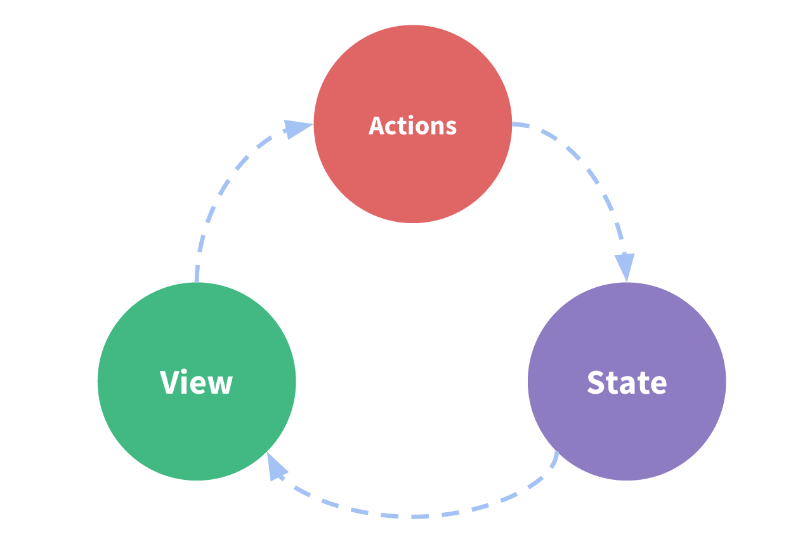
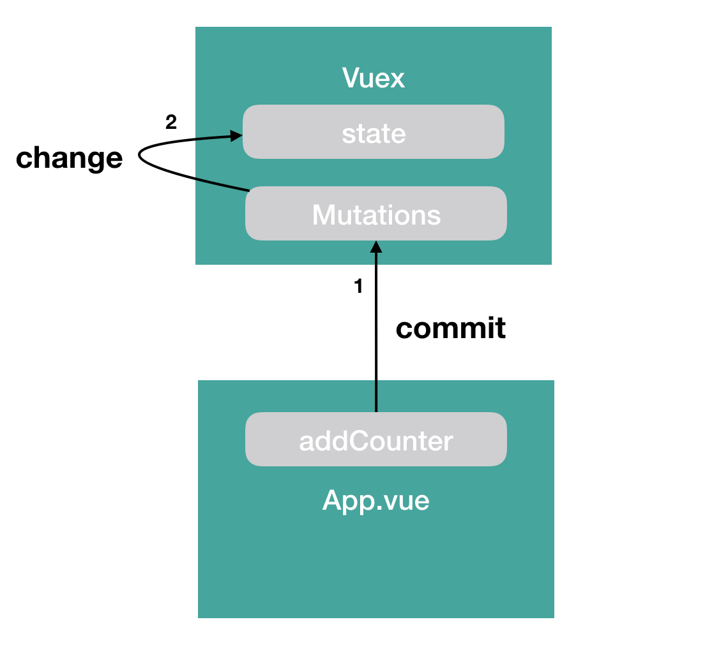
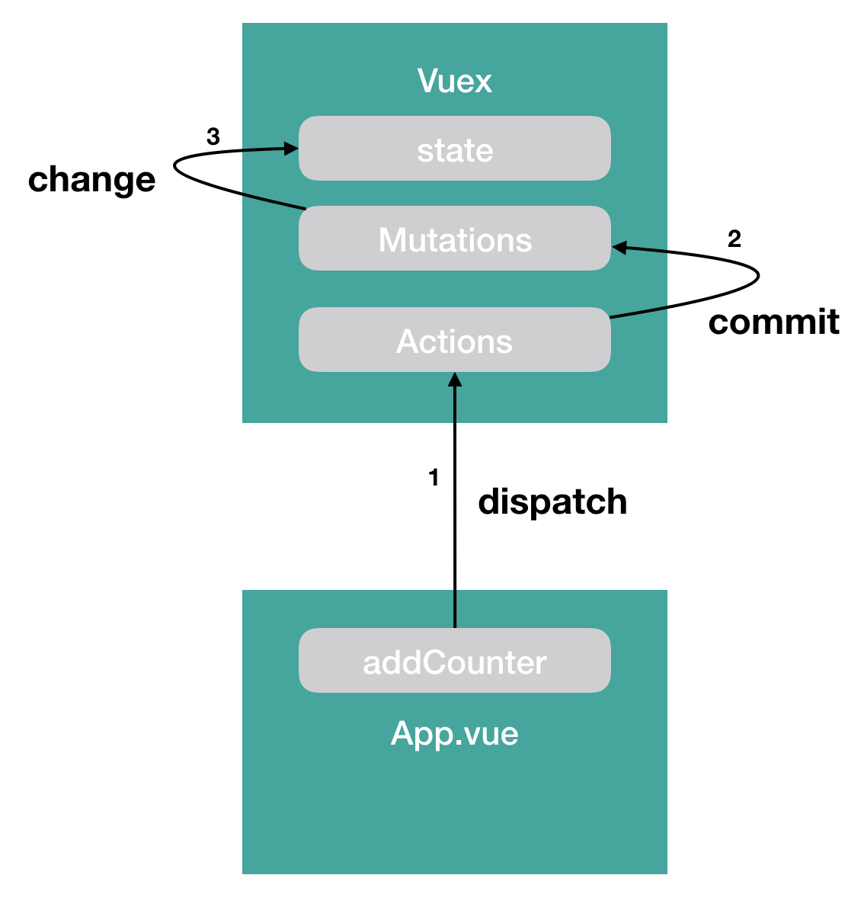

# Vuex

Vuex는 애플리케이션 **상태 관리 패턴 + 라이브러리**이다. 다른 상태관리 패턴 + 라이브러리와 비교했을때 Vue Reactivity 체계를 효율적으로 활용해 화면 업데이트가 가능하다는 장점이 있다.

> Vue Reactivity
>
> 뷰가 데이터 변화를 감지하고 자동으로 화면을 갱신하는 특성

## 상태관리 구성요소



| 구성요소 | 설명                                    |
| -------- | --------------------------------------- |
| state    | 컴포넌트간 공유하는 **data**            |
| view     | 데이터가 표현될 **template**            |
| actions  | 사용자의 입력에 따라 반응할 **methods** |

```js
new Vue({
  // state
  data () {
    return {
      count: 0
    }
  },
  // view
  template: `
    <div>{{ count }}</div>
  `,
  // actions
  methods: {
    increment () {
      this.count++
    }
  }
})
```

## 상태 관리가 필요한 이유

1. 하위 컴포넌트에서 다른 컴포넌트로 데이터를 전달할 때 그 사이에 수많은 컴포넌트가 존재한다면, props로 데이터를 전달하게 되면 그 사이의 모든 컴포넌트에 props를 설정해줘야하며, 유지보수가 힘들어진다. 
2. 이벤트 버스를 활용하게되면 상-하위 데이터 전달 구조를 따르지 않고도 한 번에 데이터를 전달할 수 있지만, 단방향 데이터 흐름이 아닌 셀 수 없이 많은 데이터 흐름이 된다는 문제점이 있다.

즉, 컴포넌트 간 데이터 전달 및 이벤트 통신등의 여러 컴포넌트 관계를 관리하기 쉽게 구조화 하는 것(중앙 집중식 저장소)이 상태관리(state management)이다.


## Basic

```js
import Vue from 'vue'
import App from './App.vue'
import store from './store'

Vue.config.productionTip = false

new Vue({
  store,
  render: h => h(App)
}).$mount('#app')

```

```js
// store/index.js 
import Vue from 'vue'
import Vuex from 'vuex'

Vue.use(Vuex)

export default new Vuex.Store({
  state: {
  },
  mutations: {
  },
  actions: {
  },
  modules: {
  }
});
```

vuex의 중심에는 **store**가 있다. "저장소"는 기본적으로 애플리케이션 상태(state)를 보유하고 있는 컨테이너이다. Vuex 저장소는 다른 전역 객체와 두 가지 차이점이 있다.

1. Vuex store는 반응형이다. 
2. store의 state를 직접 변경할 수 없다. state를 변경하는 유일한 방법은 명시적인 commit으로 변경할 수 있다.

### Getters

중앙 데이터 관리식 구조에서 발생하는 문제점 중 하나는 각 컴포넌트에서 Vuex의 데이터에 접근할 때 **중복된 코드를 반복 호출**하게 된다는 것이다.

```js
// App.vue
computed: {
  getCounter() {
    return this.$store.state.counter;
  }
},
// Child.vue
computed: {
  getCounter() {
    return this.$store.state.counter;
  }
},
```

Vuex의 state 변경을 각 컴포넌트에서 수행하는 것이 아니라 다음과 같이 Vuex에서 수행하도록하고, 각 컴포넌트에서 수행 로직을 호출할 수 있다.

```js
import Vue from 'vue'
import Vuex from 'vuex'

Vue.use(Vuex)

export default new Vuex.Store({
  state: {
  	counter: 0
  },
  getters: {
  	getCounter( state ) {
  		return state.counter;
  	}
  },
  mutations: {
  },
  actions: {
  },
  modules: {
  }
});
```

```js
// App.vue
computed: {
  parentCounter() {
    this.$store.getters.getCounter;
  }
},
// Child.vue
computed: {
  childCounter() {
    this.$store.getters.getCounter;
  }
},
```

#### mapGetters

Vuex에 내장된 helper함수이다. mapGetters로 더 직관적이게 코드를 작성할 수 있다.

```html
<!-- App.vue -->
<div id="app">
  Parent counter : {{ parentCounter }}
</div>
```

```js
// App.vue
import { mapGetters } from 'vuex'

export default({
  computed: mapGetters({
    parentCounter: 'getCounter'
  })
});
```

또는 Vuex의 getters 속성 이름과 컴포넌트의 computed 속성을 동일하게 해 더 간단하게 선언할 수 있다.

```html
<!-- App.vue -->
<div id="app">
  Parent counter : {{ getCounter }}
</div>
```

```js
// App.vue
import { mapGetters } from 'vuex'

export default({
  computed: mapGetters([
    'getCounter'
  ]),
});
```

**위 방법들은 컴포넌트 자체에서 사용할 computed 속성과 함께 사용할 수 없다.** ES6의 `...` 문법을 사용하여 해결할 수 있다.

```js
// App.vue
import { mapGetters } from 'vuex'

computed: {
  ...mapGetters([
    'getCounter'
  ]),
  anotherCounter() {
    // ...
  }
}
```

다만 `...` 문법을 사용하면 babel stage-2 라이브러리 설치 및 설정이 필요하다.

### Mutations

Vuex의 state(데이터) 값을 변경하는 로직을 의미한다.

#####  vs Getters

- 인자를 받아 Vuex에 넘겨줄 수 있다.
- computed가 아닌 methods에 등록한다.

##### vs Actions

- Mutations는 **동기 로직**을 정의한다.
- Actions는 **비동기 로직**을 정의한다.

**Mutations의 성격상 정의한 로직들이 순차적으로 일어나야 각 컴포넌트의 반영 여부를 제대로 추적할 수 있기 때문이다.**

Mutations을 이용해 상태 변화를 명시적으로 수행함으로써 **testing, debugging, Vue의 Reactive 성질 준수**를 할 수 있다.



다음과 같이 `commit` 으로 state를 변경할 수 있다.

```js
import Vue from "vue";
import Vuex from "vuex";

Vue.use(Vuex);

export default new Vuex.Store({
  state: {
    counter: 0
  },
  getters: {
    getCounter(state) {
      return state.counter;
    }
  },
  mutations: {
    addCounter(state, payload) {
      return state.counter++;
    }
  }
});
```

```js
export default {
  methods: {
    addCounter() {
      this.$store.commit('addCounter');
    },
    subCounter() {
      this.$store.commit('subCounter');
    }
  },
  ...
};
```

`.commit` 을 이용하여 mutations 이벤트를 호출하여 상태 값을 변경할 수 있다.

##### 인자 값 넘기기

```js
this.$store.commit('subCounter', 10);
```

```js
this.$store.commit('subCounter', {
  value: 10,
  arr: ["1", "3"]
});
```

특정한 값을 넘기고 싶으면 두번째 인자를 추가해 전달할 수 있다. 전달된 인자 값은 vuex에서 다음과 같이 받을 수 있다.

```js
mutations: {
  addCounter(state, payload) {
    state.counter = payload.value;
  }
}
```

>  여기서 데이터 인자명은 보통 payload를 사용한다.

#### mapMutations

Vuex의 내장된 helper로 mapMutations를 이용해 코드 가독성을 높일 수 있다.

```js
// App.vue
import { mapMutations } from 'vuex'

methods: {
  ...mapMutations([
    'addCounter'
  ]),
  ...mapMutations({
    addCounter: 'addCounter'
  })
}
```

 Vuex 의 Mutations 메서드 명과 App.vue 메서드 명이 동일할 때 \[\] 사용하며, 명칭이 다른 경우에는 \{\}를 사용한다.

### Actions

Mutations는 state관리를 주로 하며, 상태 관리는 한 데이터에 대해 여러 컴포넌트가 관여하는 것을 효율적으로 하기 위함이므로 비동기 처리 로직을 포함하지 않는다. Actions에서 비동기 처리 로직을 관리한다.

`setTimeout()` 이나 서버와의 http 통신과 같이 결과를 받아오는 시간이 예측되지 않는 로직은 actions에 선언한다.

```js
import Vue from "vue";
import Vuex from "vuex";

Vue.use(Vuex);

export default new Vuex.Store({
	...
   actions: {
    addCounter(context) {
      return context.commit('addCounter');
    }
  }
});

```

```js
// App.vue
methods: {
  // Actions 를 이용할 때
  addCounter() {
    this.$store.dispatch('addCounter');
  }
},
```

Actions를 호출할 때는 `.dispatch()` 를 이용한다.



Actions에서 인자를 넘기는 방법은 Mutations와 유사하다.

#### mapActions

mapActions도 위의 map과 동일한 방식으로 사용할 수 있다.

```js
import {mapActions} from 'vuex';

export default {
  methods: {
    ...mapActions([
      'asyncIncrement',
      'asyncDecrement'
    ])
  },
}
```


## 참조

- [Vuex 시작하기1~3](https://joshua1988.github.io/web-development/vuejs/vuex-start/)
- [Vuex 공식문서](https://vuex.vuejs.org/kr/)

