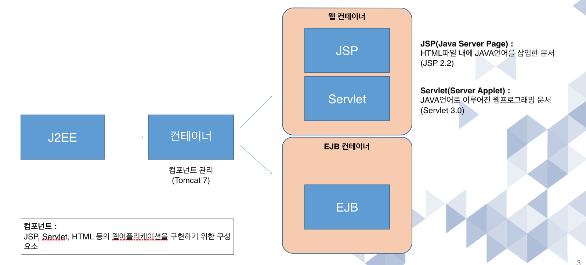
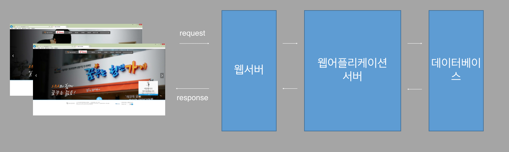

#  웹 프로그래밍

- [신입 프로그래머를 위한 실전 JSP 강좌](https://www.inflearn.com/course/%EC%8B%A4%EC%A0%84-jsp-%EA%B0%95%EC%A2%8C/)
- [스프링 MVC 1편 - 백엔드 웹 개발 핵심 기술](https://inf.run/pYeB)
- 각종 참조 링크

를 보고 공부한 내용을 정리한 책입니다.

## 웹 프로그래밍이란?

- 웹 어플리케이션을 구현하는 행위이다.
- 웹어플리케이션 : 웹을 기반으로 작동되는 프로그램
- 웹 : 1개 이상의 사이트가 연결되어있는 인터넷 서비스의 한가지 형태
  - 네트워크를 통한 서비스 : 인터넷 서비스
  - WWW(World Wide Web)을 줄여서 웹이라한다.
  - 인터넷 서비스는 많은데 그 중 하나가 웹인 것이다.
- 인터넷 : 1개 이상의 네트워크가 연결되어있는 형태

## 웹 개념

- 프로토콜(protocol) : 네트워크 상에서 약속한 통신규약(http, FTP, SMTP, POP, DHCP)
  - **HTTP**(**H**yper**T**ext **T**ransfer **P**rotocol) : WWW상에서 정보를 주고 받을 수 있는 프로토콜이다. 주로 HTML 문서를 주고받는데 사용된다.
    - 즉, 클라이언트와 서버 사이에 이루어지는 요청/응답 프로토콜이다.
    -  클라이언트인 웹브라우저가 HTTP를 통하여 서버로부터 웹페이지나 그림 정보를 요청하면, 서버는 이 요청에 응답하여 필요한 정보를 해당 사용자에게 전달하게 된다. 
    - TCP와 UDP를 사용하며, 80번 포트를 사용한다.
  - **FTP**(**F**ile **T**ransfer **P**rotocol) : TCP/IP 네트워크 상에서 컴퓨터들이 파일을 교환하기 위한 프로토콜이다.
    - 제어용( 21번 포트), 데이터 전송(20번 포트)
    - 파생형으로 TLS프로토콜과 결합한 FTPS
    - SSH 프로토콜과 결합한 SFTPS(22번 포트)
    - FTPS와 SFTPS는 보안 전송이라는 특성상 FTP보다 파일 전송 속도가 느리다.
  - **SMTP**(**S**imple **M**ail **T**ransfer **P**rotocol) : 인터넷에서 이메일을 보내기 위해 이용되는 프로토콜
    - 25번 포트 사용
    - 메일 서버간의 송수신뿐만 아니라, 메일 클라이언트에서 메일 서버로 메일을 보낼때에도 사용되는 경우가 많다.
  -  **POP**(**P**ost **O**ffice **P**rotocol) : 원격 서버로부터   TCP/IP 연결을 통해 이메일을 가져오는데 사용한다. 
    - POP3가 마지막 표준이며 대부분의 웹 메일에서 지원한다.
    - 대부분의 이메일 프로그램이 서버에 이메일을 남겨두는 기능을 제공하지만, POP은 원격 서버에 접속해서 이메일을 가져온 후 서버에서 이메일을 삭제한다.
    - IMAP와 같은 다른 프로토콜은 조금 더 복잡하고 많은 기능 제공
  - **DHCP**(**D**ynamic **H**ost **C**onfiguration **P**rotocol) : 호스트 IP 구성관리를 단순화하는 IP 표준  / 동적 호스트 설정 프로토콜
    - IP를 필요로 하는 컴퓨터에게 자동으로 할당해서 사용할 수 있도록 해주고, 사용하지 않으면 반환받아 다른 컴퓨터가 사용할 수 있도록 해준다.
    - 보통 라우터 장비에 해당 기능이 탑재되지만, 서버에 DHCP 서비스를 설정하여 사용할 수 도 있다.
- IP : 네트워크 상에서 컴퓨터를 식별할 수 있는 주소
- DNS : IP주소를 인간이 쉽게 외우도록 맵핑한 문자열
- Port : IP주소가 컴퓨터를 식별할 수 있게 해준다면, port번호는 해당 컴퓨터의 구동되고 있는 프로그램을 구분할 수 있는 번호

## JAVA 웹

JAVA 플랫폼(J2SE, J2EE)중에서 **J2EE** 를 이용한 웹프로그래밍이다.

- JSP, Servlet, HTML 을 담고 있는 것이 컨테이너
- 각각 하나하나를 컴포넌트라고 한다.

## 웹 프로그램의 동작

- 웹서버 : 클라이언트의 요청에 의해 정보를 제공해주는 서버(Aphach, IIS)
  - 별도의 구현이 필요한 로직이 있을 경우 웹 어플리케이션 서버에 요청한다.
- 웹 브라우저 : 웹서버에 요청하고 웹서버로부터 정보를 받는 매개체
  - 이때, HTTP 프로토콜을 사용한다.

