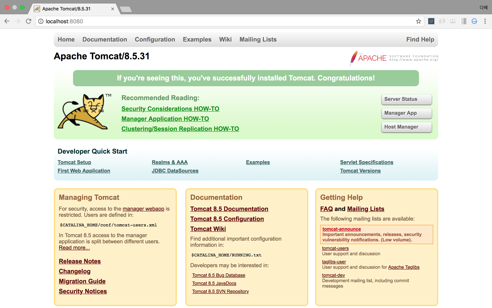
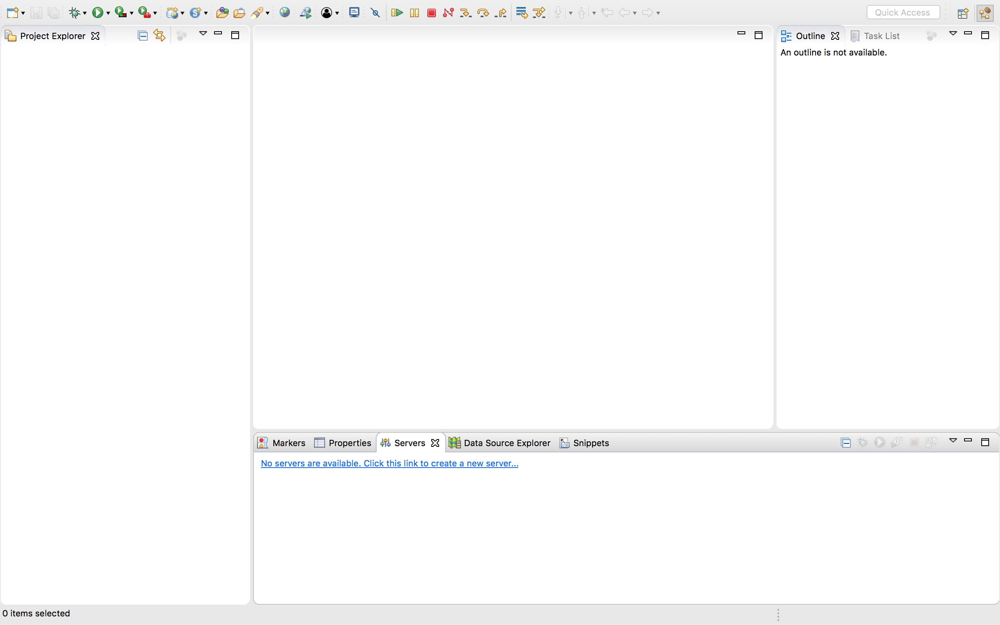
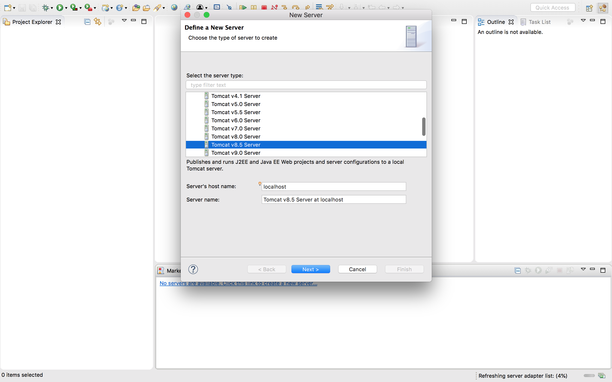
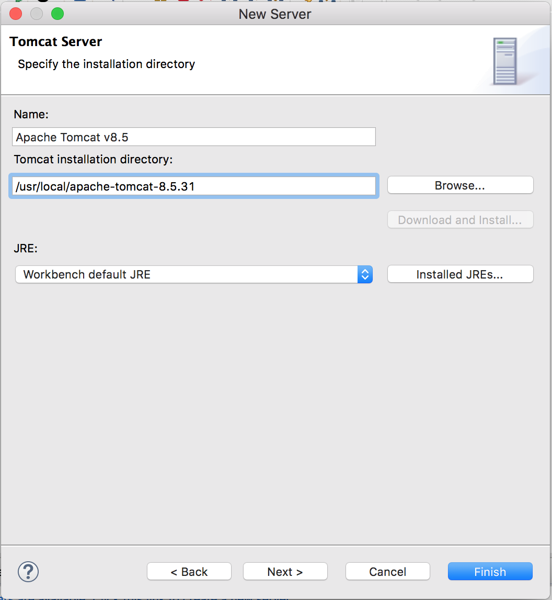
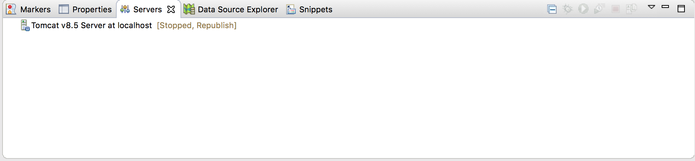
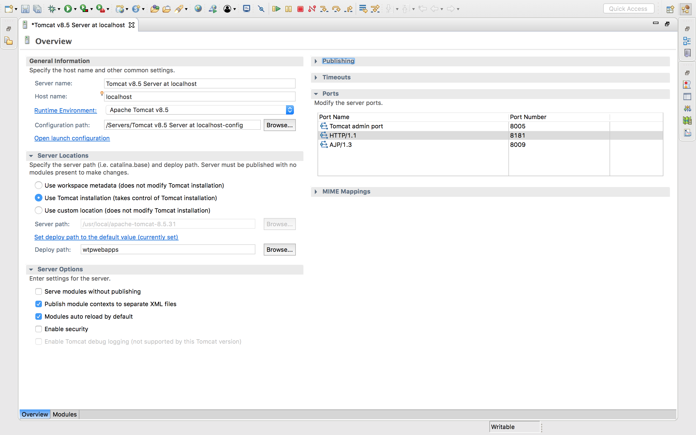

# 개발 환경 설정

### JDK 설치

**JSP**및 **Servlet**은 JAVA를 기본언어로 사용됩니다. JAVA언어로 작성한 프로그램을 컴파일하기 위해서는 JDK(Java Development Kit)가 필요 하다.

### 이클립스 다운로드

### 톰캣 다운로드

[tomcat 다운로드](https://tomcat.apache.org/download-80.cgi) 에서 tar.gz를 다운로드 한다.

```bash
$ sudo mv ~/Downloads/apache-tomcat-8.5.31 /usr/local/
$ sudo rm -f /Library/Tomcat
$ sudo ln -s /usr/local/apache-tomcat-8.5.31/ /Library/Tomcat
$ sudo chown -R <user_name> /Library/Tomcat 
$ sudo ln -s /usr/local/apache-tomcat-8.5.31/ /Library/Tomcat
$ sudo chmod +x /Library/Tomcat/bin/*.sh
# 시작하기
$ /Library/Tomcat/bin/startup.sh
# 종료하기
$ /Library/Tomcat/bin/shutdown.sh
```

http://localhost:8080 으로 접속해 아래와 같은 이미지가 보이면 성공한 것이다.



http://wonsama.tistory.com/410 참조


### 이클립스 아파치 톰캣 연동하기

servers를 열어 새로운 server를 추가해준다.



설치해둔 tomcat 서버와 연동해준다.





성공적으로 연동이 되면 아래와 같이 뜬다.



이때 더블클릭해서 세부사항을 수정해준다.

1. Server Locations에서 Use Tomcat installation으로 클릭해 내가 설치한 경로와 같게 바꿔준다.
2. public module contexts to separate XML files를 추가 클릭해준다.
3. HTTP port를 이후에 이용할 DB서버와 겹치지 않도록 8181로 변경해준다.



이후에 http://localhost:8181로 접속해 성공이미지가 뜬다면 성공한 것이다.