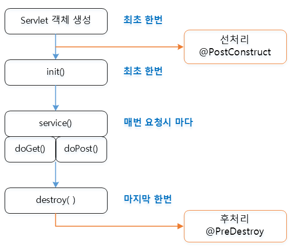

# Servlet


Servlet은 위 초록색 상자의 비즈니스 로직 실행 부분을 제외한 모든 부분을 다 자동화 해준다.

- 동적 웹어플리케이션 컴포넌트
- 클라이언트의 요청에 동적으로 작동하고, 응답은 html을 이용.
- **java thread이용**하여 동작(가장 큰 강점)
  - thread를 이용해 서버에 부하가 적다.
- MVC패턴에서 **Controller**로 이용됨.

```java
/**
 * Servlet implementation class HelloWorld
 */
@WebServlet(name = "helloServlet", urlPatterns = "/hello")
public class HelloServlet extends HttpServlet {
	private static final long serialVersionUID = 1L;

```

Servlet Class는 `HttpServlet` 클래스를 상속받는다. 그렇기 때문에 `Servlet` 인터페이스와 `GenericServlet`, `HttpServlet`의 기능을 사용할 수 있다.


Servlet의 실행 순서는 개발자가 관리하는 게 아닌 Servlet Container가 관리를 한다. Servlet에 의해 사용자가 정의한 Servlet 객체가 생성되고 호출되고 사라진다. 

이렇게 개발자가 아닌 프로그램에 의해 객체들이 관리되는 것을 [IoC(Inversion of Control)](https://github.com/dh00023/TIL/blob/master/spring/2020-03-21-IoC.md)라고 한다. 

## 요청 / 응답 처리

요청 처리 객체 및 응답 처리 객체를 Tomcat에서 받는다.

```java
protected void doGet(HttpServletRequest request, HttpServletResponse response) throws ServletException, IOException {
	...
}
/**
* @see HttpServlet#doPost(HttpServletRequest request, HttpServletResponse response)
*/
protected void doPost(HttpServletRequest request, HttpServletResponse response) throws ServletException, IOException {
	}
}

```

- `HttpServletRequest` : 클라이언트의 요청 처리 객체
- `HttpServletResponse` : 클라이언트에게 응답 처리 객체

### doGet()

**GET 방식 : URL 값으로 정보가 전송되어 보안에 약함** 

```
Get : http://IP주소:port번호/컨텍스트/path/MemberJoin?id=“abcdefg”&name=“홍길동”
```

다음과 같이 url 값으로 정보가 전송되는 방법이다.

- html form 태그의 method 속성이 get인 경우 호출된다.

```xml
<form action="GetMethod" method="get"></form>
```

- 웹브라우저의 주소창을 이용해 servlet을 요청한 경우에도 호출된다.

```java
protected void doGet(HttpServletRequest request, HttpServletResponse response) throws ServletException, IOException {
		// TODO Auto-generated method stub
		System.out.println("doGet");
		// 무엇으로 응답할 지 구현해 줘야한다.
    	// 한글지정 charset=euc-kr
		response.setContentType("text/html; charset=euc-kr");

    	//웹 브라우저에 출력하기 위한 스트림  
		PrintWriter writer = response.getWriter();
		
		writer.println("<html>");
		writer.println("<head>");
		writer.println("</head>");
		writer.println("<body>");
		writer.println("<h1>Hello World</h1>");
		writer.println("</body>");
		writer.println("</html>");
		
		writer.close();
	}
```

### doPost()

**POST 방식 : header를 이용해 정보가 전송되어 보안에 강하다.** 

```
Post : http://IP주소:port번호/컨텍스트/path/MemberJoin
```

- html form 태그의 method 속성이 post인 경우 호출된다.

```xml
<!-- post.html -->
<form action="PostMethod" method="post">
	<input type="sublmit" value="post">
</form>
```

```java
//PostMethod.java (servlet)
//...
protected void doPost(HttpServletRequest request, HttpServletResponse response) throws ServletException, IOException {
		// TODO Auto-generated method stub
		System.out.println("doPost");
		
		response.setContentType("text/html; charset=euc-kr");
		PrintWriter writer = response.getWriter();
		writer.println("<html>");
		writer.println("<head>");
		writer.println("</head>");
		writer.println("<body>");
		writer.println("<h1>POST 방식입니다..</h1>");
		writer.println("</body>");
		writer.println("</html>");
	}
  
```

## Context Path

WAS(Web Application Server)에서 웹어플리케이션을 구분하기 위한 path 입니다. 이클립스에서 프로젝트를 생성하면, 자동으로 server.xml에 추가 됩니다.

```xml
<Valve className="org.apache.catalina.valves.AccessLogValve" directory="logs" pattern="%h %l %u %t &quot;%r&quot; %s %b" prefix="localhost_access_log" suffix=".txt"/>

      <Context docBase="ch05" path="/ch05" reloadable="true" source="org.eclipse.jst.jee.server:ch05"/></Host>
```


## Servlet 작동 순서

클라이언트에서 servlet 요청이 들어오면 서버에서는 servlet 컨테이너를 만들고 요청이 있을 때마다 스레드가 생성된다.

스레드를 이용해 request를 처리해 서버의 부하가 적게 걸린다. 


이때 Servlet 컨테이너에서 1. 스레드 생성 2. servlet 객체를 생성한다.


HTTP 요청이 발생했을 때를 생각해보자.

1. WAS는 Request, Response 객체를 새로 만들어서 서블릿 객체를 호출한다.
   - 이때, 개발자는 Request 객체에서 HTTP 요청정보를 꺼내 사용하고, Response 객체에 HTTP 응답 정보를 편리하게 입력한다.
2. WAS는 Response 객체에 담겨있는 내용으로 HTTP 응답 정보를 생성한다.


### Servlet Container(WAS)

톰캣과 같이 **서블릿을 지원하는 WAS**를 서블릿 컨테이너라고 한다. 

- 서블릿 객체를 생성, 초기화, 호출, 종료하는 **생명주기를 관리(싱글톤)**
  - 고객의 요청이 올때마다 계속 객체를 생성하는 것은 비효율
  - 최초 로딩 시점에 서블릿 객체를 미리 만들어두고 재활용
  - 모든 고객 요청은 동일한 서블릿 객체 인스턴스에 접근
  - 이때, 공유 변수는 주의해서 사용해야한다.
  - 서블릿 컨테이너 종료시 함께 종료
- JSP도 서블릿으로 변환되어 사용
- 동시 요청을 위한 **멀티 쓰레드** 처리 지원

### 동시요청 - 멀티 쓰레드

#### **쓰레드란?**

- 어플리케이션 코드를 하나하나 순차적으로 실행
- 자바 메인 메서드를 처음 실행하면 `main` 이라는 이름의 쓰레드가 실행
- 쓰레드가 없다면 자바 애플리케이션 실행 불가능
- 쓰레드는 한반에 하나의 코드 라인만 수행
- **동시 처리가 필요하면 쓰레드 추가로 생성**

#### 요청이 올때마다 쓰레드를 생성한다면?


- 장점
  - 동시 요청을 처리할 수 있다.
  - 리소스(CPU, 메모리)가 허용할 때까지 처리 가능
  - 하나의 쓰레드가 지연되어도, 나머지 쓰레드는 정상 동작
- 단점
  - 쓰레드는 생성 비용이 매우 비싸다.
    - 고객의 요청이 들어올 때마다 쓰레드를 생성하면, 응답 속도가 늦어진다.
  - 쓰레드는 컨텍스트 스위칭 비용이 발생
  - 쓰레드 생성에 제한이 없다.
    - 고객 요청이 너무 많이 오게되면, CPU, 메모리 임계점을 넘어 서버가 죽을 수 있다.

#### 쓰레드 풀


Thread Pool에 쓰레드를 미리 만들어두고 관리한다. 쓰레드 풀에 생성 가능한 쓰레드의 최대치를 관리한다.(톰캣은 200개가 default 값)

이때, 쓰레드가 필요하면 이미 쓰레드풀에 생성되어 있는 쓰레드를 꺼내서 사용하고 사용을 완료하면, 쓰레드 풀에 해당 쓰레드를 반납한다. 만약 쓰레드 풀에 있는 모든 쓰레드가 사용중이라면, 요청을 거절하거나, 특정 숫자만큼만 대기하도록 설정할 수 있다.

이렇게 쓰레드 풀을 사용하면 다음과 같은 장점이 있다.

1. 쓰레드가 미리 생성되어 있어, 쓰레드를 생성하고 종료하는 비용(CPU)이 절약되고, 응답 시간이 빨라진다.
2. 생성 가능한 쓰레드의 최대치가 있으므로 너무 많은 요청이 들어와도 기존 요청은 안전하게 처리할 수 있다.

여기서 최대 쓰레드 수(max thread) 설정이 가장 주요 튜닝 포인트이다.

이 값을 너무 낮게 설정하게되면, 동시 요청이 많이 들어왔을때 서버 리소스는 여유롭지만, 클라이언트는 금방 응답 지연이되는 현상이 발생할 수 있다.

반대로 최대 쓰레드 수를 너무 높게 설정하면, 동시 요청이 많이 들어왔을때, CPU, 메모리 리소스 임계점 초과로 서버가 다운된다.

그렇다면 적정 수는 어떻게 찾을까? 애플리케이션 로직의 복잡도, CPU, 메모리, IO 리소스 상황에 따라 모두 다르다. 그러므로 최대한 실제 서비스와 유사하게 성능 테스트를 시도해봐야한다. (아파치 ab, 제이미터, nGrinder )


즉, **핵심은 WAS가 멀티쓰레드에 대한 부분은 모두 처리**해준다는 것이다. 멀티 쓰레드 관련 코드를 신경쓰지 않아도 되며, 개발자는 싱글 쓰레드 프로그래밍을 하듯이 편리하게 소스 코드를 개발할 수 있다. 하지만, **멀티 쓰레드 환경이므로 싱글톤 객체는 주의해서 사용해야한다.**

### Servlet life cycle(생명주기)

Servlet의 사용도가 높은 이유는 **빠른 응답 속도** 때문이다. Servlet은 최초 요청 시 객체가 만들어져 메모리에 로딩되고, 이후 요청에는 기존의 객체를 재활용하게 되므로 동작 속도가 빠르다.


```java
@WebServlet("/LifeCycleEx")
public class LifeCycleEx extends HttpServlet {
	private static final long serialVersionUID = 1L;
       
    /**
     * @see HttpServlet#HttpServlet()
     */
    public LifeCycleEx() {
        super();
        // TODO Auto-generated constructor stub
    }

//	@Override
//	public void service(ServletRequest arg0, ServletResponse arg1)
//			throws ServletException, IOException {
//		// TODO Auto-generated method stub
//		System.out.println("service");
//	}
    
    @Override
    public void init() throws ServletException {
    	// TODO Auto-generated method stub
    	System.out.println("init");
    }

	@Override
	public void destroy() {
		// TODO Auto-generated method stub
		System.out.println("destroy");
	}


	/**
	 * @see HttpServlet#doGet(HttpServletRequest request, HttpServletResponse response)
	 */
	protected void doGet(HttpServletRequest request, HttpServletResponse response) throws ServletException, IOException {
		// TODO Auto-generated method stub
		System.out.println("doGet");
	}

	/**
	 * @see HttpServlet#doPost(HttpServletRequest request, HttpServletResponse response)
	 */
	protected void doPost(HttpServletRequest request, HttpServletResponse response) throws ServletException, IOException {
		// TODO Auto-generated method stub
		System.out.println("doPost");
	}
}
```

```
init
doGet
doGet
doGet
destroy
```

새로 고침하면 doGet만 반복해서 호출되는 것을 확인할 수 있다. 어느 시점에 호출이 되는지 알고 있어야한다.

### Servlet 선처리 / 후처리



#### 선처리 @PostConstruct

init전에 한번 호출되는 것

```java
@PostConstruct
private void initPostConstruct() {
	// TODO Auto-generated method stub
	System.out.println("initPostConstruct");
}
```


#### 후처리 @PreDestroy

destroy 후에 호출된다.

```java
@PreDestroy
private void destoryPreDestory() {
	// TODO Auto-generated method stub
	System.out.println("destoryPreDestory");
}
```

```
initPostConstruct
init
doGet
doGet
doGet
doGet
destroy
destoryPreDestory
```


### HTML Form tag

form태그는 서버쪽으로 정보를 전달할 때 사용하는 태그이다.[[HTML - form](https://dh00023.gitbooks.io/til/HTML&CSS/chapter4.html) ]태그와 관련해서 정리해둔 자료이다.

```html
<form action="요청하는 컴포넌트 이름" method=["post"|"get"]>
</form>
```

요청하는 컴포넌트 이름에는 이동할 위치를 넣어준다. (ex) join.jsp, info.html, HWorldServlet Parameter

```html
<!DOCTYPE html>
<html>
<head>
<meta charset="UTF-8">
<title>Insert title here</title>
</head>
<body>
	<form action="FormMethod" method="get">
		이름 : <input type="text" name="name" size="10"><br/>
		아이디: <input type="text" name="id" size="10"><br/>
		비밀번호 : <input type="password" name="pw" size="10"><br/>
		취미 : <input type="checkbox" name="hobby" value="read">독서
		<input type="checkbox" name="hobby" value="cook">요리
		<input type="checkbox" name="hobby" value="run">조깅
		<input type="checkbox" name="hobby" value="swim">수영
		<input type="checkbox" name="hobby" value="sleep">취침<br/>
		<input type="radio" name="major" value="kor">국어
		<input type="radio" name="major" value="eng" checked="checked">영어
		<input type="radio" name="major" value="mat" >수학
		<input type="radio" name="major" value="des" >디자인<br/>
		<select name="protocol">
			<option value="http">http</option>
			<option value="ftp" selected="selected">ftp</option>
			<option value="smtp">smtp</option>
			<option value="pop">pop</option>
		</select><br/>
		<input type="submit" value="제출"><input type="reset" value="초기화">
	</form>
</body>
</html>
```


### Servlet Parameter

form 태그의 submit 버튼을 클릭하여 데이터를 서버로 전송하면, 해당파일(servlet)에서는 **HttpServletRequest 객체를 이용해서 Parameter값을 얻을 수 있다**.

반환값은 다 String이다.

- getParameter(name) : name에 해당하는 value값을 리턴
- getParameterValues(name) : value값들이 여러개인 경우(체크박스를 사용하는 경우)에 사용
- getParameterNames() : name들의 배열이 넘어온다.

```java
protected void doPost(HttpServletRequest request, HttpServletResponse response) throws ServletException, IOException {
		// TODO Auto-generated method stub
		
		System.out.println("doPost");
		request.setCharacterEncoding("utf-8");
		
		String name = request.getParameter("name");
		String id = request.getParameter("id");
		
		
		String pw = request.getParameter("pw");
		
		String[] hobbys = request.getParameterValues("hobby");
		String major = request.getParameter("major");
		String protocol = request.getParameter("protocol");
		
		response.setContentType("text/html; charset=utf-8");
		PrintWriter writer = response.getWriter();
		
		writer.println("<html><head></head><body>");
		writer.println("이름 : " + name + "<br />");
		writer.println("아이디 : " + id + "<br />");
		writer.println("비밀번호 : " + pw + "<br />" );
		writer.println("취미 : " + Arrays.toString(hobbys) + "<br />");
		writer.println("전공 : " + major + "<br />");
		writer.println("프로토콜 : " + protocol);
		writer.println("</body></html>");
	}

}
```


#### ServletConfig

 **특정 Servlet**이 생성될 때 초기에 필요한 데이터들을 초기화 파라미터이다.

`web.xml` 에 기술하고 Servlet파일에서는 `ServletConfing` 클래스를 이용해서 접근(사용)한다.

+`web.xml`이 아닌 Servlet파일에 직접 기술하는 방법도 있다.

#### web.xml이용하기

```xml
<?xml version="1.0" encoding="UTF-8"?>
<web-app xmlns:xsi="http://www.w3.org/2001/XMLSchema-instance" xmlns="http://java.sun.com/xml/ns/javaee" xsi:schemaLocation="http://java.sun.com/xml/ns/javaee http://java.sun.com/xml/ns/javaee/web-app_3_0.xsd" id="WebApp_ID" version="3.0">
  <display-name>jsp_8_1_ex1_initparamex</display-name>
  <welcome-file-list>
    <welcome-file>index.html</welcome-file>
    <welcome-file>index.htm</welcome-file>
    <welcome-file>index.jsp</welcome-file>
    <welcome-file>default.html</welcome-file>
    <welcome-file>default.htm</welcome-file>
    <welcome-file>default.jsp</welcome-file>
  </welcome-file-list>
  
  <servlet>
  	<servlet-name>ServletInitParam</servlet-name>
  	<servlet-class>com.javalec.ex.ServletInitParam</servlet-class>
  	
  	<init-param>
  		<param-name>id</param-name>
  		<param-value>abcdef</param-value>
  	</init-param>
  	<init-param>
  		<param-name>pw</param-name>
  		<param-value>1234</param-value>
  	</init-param>
  	<init-param>
  		<param-name>path</param-name>
  		<param-value>C:\\javalec\\workspace</param-value>
  	</init-param>
  	
  </servlet>
  <servlet-mapping>
  	<servlet-name>ServletInitParam</servlet-name>
	<url-pattern>/InitParam</url-pattern>
  </servlet-mapping>
  
</web-app>
```

```java
package com.javalec.ex;

import java.io.IOException;
import java.io.PrintWriter;

import javax.servlet.ServletException;
import javax.servlet.annotation.WebServlet;
import javax.servlet.http.HttpServlet;
import javax.servlet.http.HttpServletRequest;
import javax.servlet.http.HttpServletResponse;

/**
 * Servlet implementation class ServletInitParam
 */
//@WebServlet("/ServletInitParam")
public class ServletInitParam extends HttpServlet {
	private static final long serialVersionUID = 1L;
       
    /**
     * @see HttpServlet#HttpServlet()
     */
    public ServletInitParam() {
        super();
        // TODO Auto-generated constructor stub
    }

	/**
	 * @see HttpServlet#doGet(HttpServletRequest request, HttpServletResponse response)
	 */
	protected void doGet(HttpServletRequest request, HttpServletResponse response) throws ServletException, IOException {
		// TODO Auto-generated method stub
		System.out.println("doGet");
		
		String id = getInitParameter("id");
		String pw = getInitParameter("pw");
		String path = getInitParameter("path");
		
		response.setContentType("text/html; charset=EUC-KR");
		PrintWriter writer = response.getWriter();
		writer.println("<html><head></head><body>");
		writer.println("아이다 : " + id + "<br />");
		writer.println("비밀번호 : " + pw + "<br />");
		writer.println("path : " + path);
		writer.println("</body></html>");
		
		writer.close();
	}

	/**
	 * @see HttpServlet#doPost(HttpServletRequest request, HttpServletResponse response)
	 */
	protected void doPost(HttpServletRequest request, HttpServletResponse response) throws ServletException, IOException {
		// TODO Auto-generated method stub
		System.out.println("doPost");
	}

}
```


#### Servlet 파일에 직접 기술하기

```java
@WebServlet(urlPatterns={"/ServletInitParam"}, initParams={@WebInitParam(name="id", value="abcdef"), @WebInitParam(name="pw", value="1234")})
```


### 데이터 공유 : ServletContext

여러 Servlet에서 특정 데이터를 공유해야할 경우 context parameter를 이용해서 `web.xml` 에 기술하고, Servlet에서 공유하면서 사용할 수 있다.

이때 `<servlet>`보다 위쪽에 있어야한다.

```xml
  <context-param>
  	<param-name>id</param-name>
  	<param-value>abcdef</param-value>
  </context-param>
  <context-param>
  	<param-name>pw</param-name>
  	<param-value>1234</param-value>
  </context-param>
  <context-param>
  	<param-name>path</param-name>
  	<param-value>C:\javalec\workspace</param-value>
  </context-param>
```

```java
String id = getServletContext().getInitParameter("id");
String pw = getServletContext().getInitParameter("pw");
String path = getServletContext().getInitParameter("path");		
```


### 웹어플리케이션 감시

웹어플리케이션의 **생명주기(LifeCycle)를 감시하는 리스너(Listener)**가 있습니다. 바로 **ServletContextListener** 입니다.

리스너의 해당 메소드가 **웹 어플리케이션의 시작과 종료 시 호출** 됩니다.(contextInitialized(), contextDestroyed())

(클래스 생성 + implements ServletContextListener)를 해줘야한다.

```xml
<listener>
	<listener-class>com.javalec.ex.ContextListenerEx</listener-class>
</listener>
```

```java
package com.javalec.ex;

import javax.servlet.ServletContextEvent;
import javax.servlet.ServletContextListener;
import javax.servlet.annotation.WebListener;

@WebListener
public class ContextListenerEx implements ServletContextListener{

	public ContextListenerEx() {
		// TODO Auto-generated constructor stub
	}

	@Override
	public void contextDestroyed(ServletContextEvent arg0) {
		// TODO Auto-generated method stub
		System.out.println("contextDestroyed");
	}

	@Override
	public void contextInitialized(ServletContextEvent arg0) {
		// TODO Auto-generated method stub
		System.out.println("contextInitialized");
	}
	
}
```


### 한글 처리

 Tomcat 서버의 기본 문자 처리방식은 **IOS-8859-1** 방식이다. 따라서 개발자가 따로 한글 인코딩을 하지않으면 한글이 깨져보인다.

#### Get방식 - server.xml 수정

```xml
<Connector URIEncoding="utf-8" connectionTimeout="20000" port="8181" protocol="HTTP/1.1" redirectPort="8443"/>
```

#### Post 방식 - `.setCharacterEncoding`

```java
request.setCharacterEncoding("utf-8");
```

