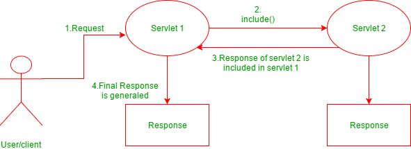

# 포워딩(Forwarding)

서블릿 또는 JSP에서 요청을 받은 후에 다른 component로 요청을 위임할 수 있다. 그것을 포워딩이라한다.

포워딩 방법에는 2개의 클래스(RequestDispatcher, HttpServletResponse)를 이용한다.

## RequestDispatcher 클래스



요청받은 요청객체(request)를 위임받는 컴포넌트(S2)에 동일하게 전달할 수 있다.


### 예제

#### dispatcher.jsp

```jsp
<%@ page language="java" contentType="text/html; charset=EUC-KR"
    pageEncoding="EUC-KR"%>
<!DOCTYPE html PUBLIC "-//W3C//DTD HTML 4.01 Transitional//EN" "http://www.w3.org/TR/html4/loose.dtd">
<html>
<head>
<meta http-equiv="Content-Type" content="text/html; charset=EUC-KR">
<title>Insert title here</title>
</head>
<body>

		dispacherJsp.jsp
		<hr />
		
		id : <%= request.getAttribute("id") %> <br />
		pw : <%= request.getAttribute("pw") %>

</body>
</html>
```

#### RequestObj.java

```java
package com.javalec.ex;

import java.io.IOException;

import javax.servlet.RequestDispatcher;
import javax.servlet.ServletException;
import javax.servlet.annotation.WebServlet;
import javax.servlet.http.HttpServlet;
import javax.servlet.http.HttpServletRequest;
import javax.servlet.http.HttpServletResponse;

/**
 * Servlet implementation class RequestObj
 */
@WebServlet("/RequestObj")
public class RequestObj extends HttpServlet {
	private static final long serialVersionUID = 1L;
       
    /**
     * @see HttpServlet#HttpServlet()
     */
    public RequestObj() {
        super();
        // TODO Auto-generated constructor stub
    }

	/**
	 * @see HttpServlet#doGet(HttpServletRequest request, HttpServletResponse response)
	 */
	protected void doGet(HttpServletRequest request, HttpServletResponse response) throws ServletException, IOException {
		// TODO Auto-generated method stub
		System.out.println("doGet");
		actionDo(request, response);
	}

	/**
	 * @see HttpServlet#doPost(HttpServletRequest request, HttpServletResponse response)
	 */
	protected void doPost(HttpServletRequest request, HttpServletResponse response) throws ServletException, IOException {
		// TODO Auto-generated method stub
		System.out.println("doPost");
		actionDo(request, response);
	}
	
	private void actionDo(HttpServletRequest request, HttpServletResponse response) throws ServletException, IOException {
		// TODO Auto-generated method stub
		System.out.println("actionDo");
		
		request.setAttribute("id", "abcde");
		request.setAttribute("pw", "12345");
		
		RequestDispatcher dispatcher = request.getRequestDispatcher("/dispacherJsp.jsp");
		dispatcher.forward(request, response);
		
	}
}
```

```java
RequestDispatcher dispatcher = request.getRequestDispatcher("/dispacherJsp.jsp");
dispatcher.forward(request, response);
```

클라이언트가 준 request객체에서 `getRequestDispatcher("위임받을 컴포넌트")` 로 생성해준다.

`dispatcher.forward` 로 전달해준다. 두 파일에서 사용하는 파일이 동일한 request라는 것을 확인할 수 있다.


## HttpServletResponse 클래스


 Request를 위임하는 클래스이다. 하지만 RequestDispatcher 클래스와의 차이점은 요청받은 객체를 위임 받는 컴포넌트에 전달하는 것이 아닌 **새로운 객체를 생성**한다.

### 예제

#### JSP

```jsp
<%@ page language="java" contentType="text/html; charset=EUC-KR"
    pageEncoding="EUC-KR"%>
<!DOCTYPE html PUBLIC "-//W3C//DTD HTML 4.01 Transitional//EN" "http://www.w3.org/TR/html4/loose.dtd">
<html>
<head>
<meta http-equiv="Content-Type" content="text/html; charset=EUC-KR">
<title>Insert title here</title>
</head>
<body>

		<%
			request.setAttribute("id", "abcde");
			request.setAttribute("pw", "12345");
			
			response.sendRedirect("RequestObj");
		%>

</body>
</html>
```

`response.sendRedirect("RequestObj");` 가 HttpServletResponse 객체이다.

#### RequestObj.java

```java
package com.javalec.ex;

import java.io.IOException;
import java.io.PrintWriter;

import javax.servlet.RequestDispatcher;
import javax.servlet.ServletException;
import javax.servlet.annotation.WebServlet;
import javax.servlet.http.HttpServlet;
import javax.servlet.http.HttpServletRequest;
import javax.servlet.http.HttpServletResponse;

/**
 * Servlet implementation class RequestObj
 */
@WebServlet("/RequestObj")
public class RequestObj extends HttpServlet {
	private static final long serialVersionUID = 1L;
       
    /**
     * @see HttpServlet#HttpServlet()
     */
    public RequestObj() {
        super();
        // TODO Auto-generated constructor stub
    }

	/**
	 * @see HttpServlet#doGet(HttpServletRequest request, HttpServletResponse response)
	 */
	protected void doGet(HttpServletRequest request, HttpServletResponse response) throws ServletException, IOException {
		// TODO Auto-generated method stub
		System.out.println("doGet");
		actionDo(request, response);
	}

	/**
	 * @see HttpServlet#doPost(HttpServletRequest request, HttpServletResponse response)
	 */
	protected void doPost(HttpServletRequest request, HttpServletResponse response) throws ServletException, IOException {
		// TODO Auto-generated method stub
		System.out.println("doPost");
		actionDo(request, response);
	}
	
	private void actionDo(HttpServletRequest request, HttpServletResponse response) throws ServletException, IOException {
		// TODO Auto-generated method stub
		System.out.println("actionDo");
		
		String id = (String)request.getAttribute("id");
		String pw = (String)request.getAttribute("pw");
		
		response.setContentType("text/jhtml; charset=EUC-KR");
		PrintWriter writer = response.getWriter();
		writer.print("<html><head></head><body>");
		writer.print("RequestObj" + "<hr />");
		writer.print("id : " + id + "<br />");
		writer.print("pw : " + pw);
		writer.print("</body></html>");
		
	}
}
```

```
id: null
pw: null
```

null값이 뜨는 것을 볼 수 있다.  위임을 한다고 해서 바로 전달되는 것이 아니라 클라이언트가 다시 위임 받은 컴포넌트를 요청한다. 새로운 객체가 생성되어 전달되므로 요청받은 컴포넌트에 `setAttribute` 해준 값은 위임받은 Component로 전달되지 않는다.